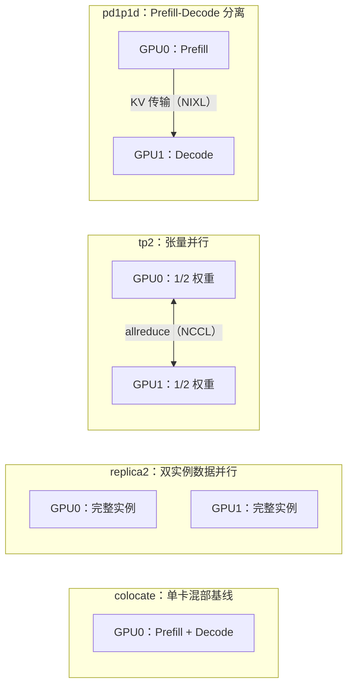
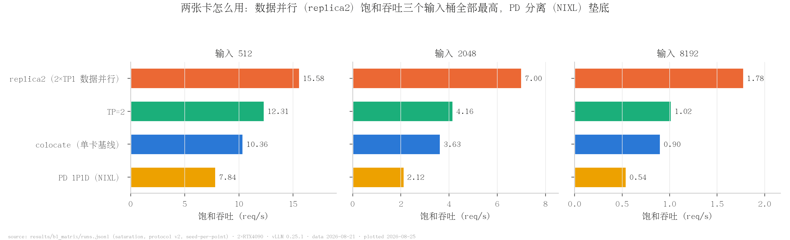
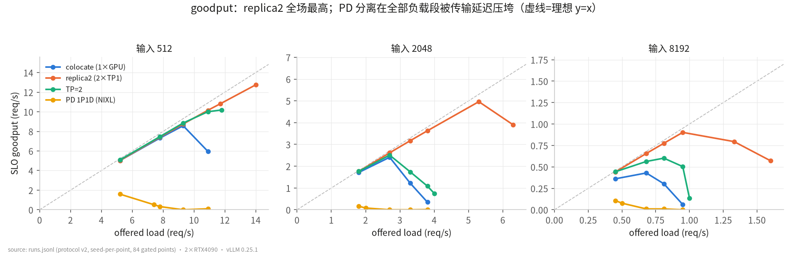
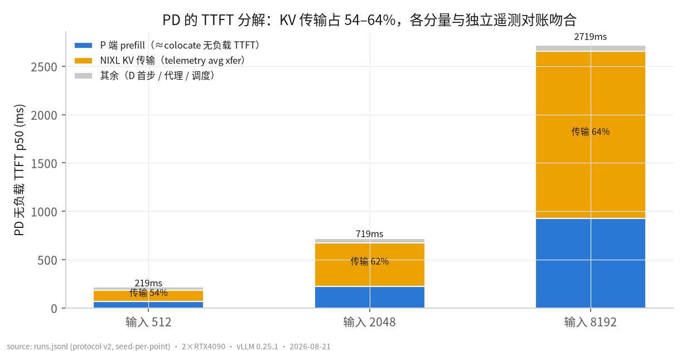
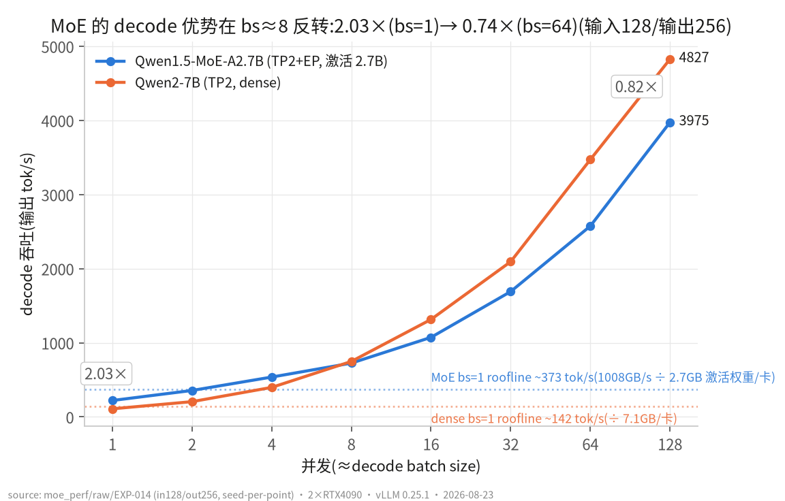

# vLLM 推理部署选型与 MoE 优化实验

*消费级双卡平台上的部署形态基准与 MoE kernel 级分解*

本仓库在 2×RTX 4090（无 NVLink、P2P 驱动禁用）的消费级平台上回答两个工程问题：多出一张卡该怎么用；MoE 推理慢在哪、还能快多少。消费级多卡是中小规模部署的常态，但公开评测几乎都基于 NVLink 互联的数据中心卡，互联受限时教科书结论是否仍然成立缺少定量答案。本仓库对 vLLM 的四种双卡部署形态（单卡混部、双实例数据并行、TP2、Prefill-Decode 分离）做全矩阵基准并把差距归因到硬件瓶颈，再对 MoE 推理路径做 kernel 级分解，交付两个社区空缺的 Triton 调优 config。全部表格与图可由脚本从仓内原始数据重算（本目录为独立嵌套 git 仓库，与外层 vLLM 源码仓互不干扰）。

## 概述

实验矩阵覆盖同一硬件上的四种部署形态，在统一负载协议下（三个输入长度桶，每个测量点唯一 seed）对比饱和吞吐、SLO goodput 与延迟分解。四臂中仅 tp2 与 pd1p1d 产生跨卡流量，这一差异在 P2P 禁用的平台上直接决定结果排序。MoE 部分以 Qwen1.5-MoE 与 Qwen3-30B-A3B 为对象，从 serving 指标向下钻到 nsys node 级 kernel 分解与 Triton config 调优。



## 性能结果

| 结论 | 关键数字 | 证据 |
|---|---|---|
| 两卡选型：数据并行优于 TP2 与 PD 分离 | 饱和吞吐（req/s，2K 输入桶）：replica2 **7.00**、tp2 4.16、pd1p1d 2.12、colocate 单卡基线 3.63 | [EXP-007](records/EXP-007_b1_sweep_campaign.md)、`pd_disagg/results/b1_matrix/runs.jsonl` |
| TP2 仅加速 decode：decode 提速 42%（权重带宽分摊），prefill 零加速 | allreduce 受限于 NCCL bus 带宽 **1.78 GB/s**（P2P 禁用） | [EXP-005](records/EXP-005_replica2_tp2_powercap.md) / [EXP-002](records/EXP-002_hardware_baseline.md)、`pd_disagg/hw/all_reduce_perf.txt` |
| PD 分离瓶颈定量：KV 等待占 TTFT **54.2 / 62.5 / 64.2%**（512/2K/8K，p50，request 级因果占比，每桶 n=11） | 六段分解闭环误差 p50 <0.1%；bytes 与 Prometheus 对账完全一致 | [EXP-013](records/EXP-013_ext1_request_level_kv_attribution.md)、`pd_disagg/ext1/derived/ext1_per_request.csv` |
| MoE 的 decode 优势在 bs≈8 反转 | MoE/dense 2.03×(bs=1) -> 0.97×(bs=8) -> **0.82×**(bs=128)；nsys node 级归因：fused_moe grouped GEMM 占 GPU 时间 56.4%（bs=32） | [EXP-014](records/EXP-014_d1_moe_kernel_decomposition.md)、`moe_perf/derived/d1_scaling.csv`、`moe_perf/derived/d1_kernel_share_bs32.csv` |
| 补齐两个社区空缺的 MoE tuning config | E=30,N=1408 / E=60,N=704（各 18 M 档）；kernel A/B：M=1 **-8.5% / -3.8%**，M≥128 -3.3~-3.9%；correctness 120 passed；PR 材料齐备（未提交） | [EXP-015](records/EXP-015_d2_moe_config_tuning.md)、`moe_perf/PR_DRAFT.md` |
| 版本升级实测（system-version comparison，v0.17.1 至 v0.25.1） | 512 桶饱和吞吐 **+45%**（7.14 -> 10.36 req/s）；启动 308 -> 58s；计算受限桶零差异 | [EXP-008](records/EXP-008_b3_version_compare.md) |



*图 1：数据并行（replica2）的饱和吞吐在三个输入桶全部最高，PD 分离最低。（数据：`pd_disagg/results/b1_matrix/runs.jsonl`，协议 v2、每点唯一 seed；脚本：`pd_disagg/scripts/make_fig7_overview.py`）*



*图 2：SLO goodput 随 offered load 变化，replica2 在全部负载段最高，PD 分离在全部负载段受传输延迟制约。（数据：`pd_disagg/results/b1_matrix/runs.jsonl`，84 个通过质量门的测量点；脚本：`pd_disagg/scripts/make_figures.py`）*



*图 3：PD 分离的 TTFT 分解，KV 传输占 54–64%，各分量与独立遥测对账吻合；request 级因果版见 [EXP-013](records/EXP-013_ext1_request_level_kv_attribution.md)。（数据：`pd_disagg/results/b1_matrix/runs.jsonl`；脚本：`pd_disagg/scripts/make_figures.py`）*



*图 4：MoE 的 decode 优势在 bs≈8 反转，2.03×(bs=1) -> 0.82×(bs=128)；小 batch 受益于激活参数量，大 batch 受制于专家权重搬运。（数据：`moe_perf/raw/EXP-014/`，并发 1–128、每点唯一 seed；脚本：`moe_perf/d1_analyze.py`）*

## 关键发现

**没有 NVLink 时，最优互联策略是避免互联。** 本平台 P2P 在驱动层被禁用，任何跨卡通信都要经过 1.78 GB/s 的 NCCL bus 带宽上限（实测，`pd_disagg/hw/`）。数据并行（replica2）零跨卡通信，因此在三个输入桶均取得最高饱和吞吐与 goodput；TP2 的 decode 能提速 42%——每张卡只读一半权重，权重带宽被分摊——但 prefill 的大消息 allreduce 直接受限于上述带宽上限，整体只换来 +13~19% 吞吐；PD 分离受影响最大：NIXL KV 通路受 ~16KB/descriptor 碎片化拖累，有效吞吐恒定在 0.26–0.27 GB/s（telemetry-derived），测量显示 KV 等待占 TTFT 的 54–64%（request 级因果占比）——传输方向反转（push）也仅挽回 6.7% TTFT，量级不变。结论：互联受限平台上部署形态的选择被硬件测量唯一确定。

**MoE 的 decode 优势是激活参数量的优势，且随 batch 递减直至反转。** bs=1 时 MoE 每 token 只读 ~2.7B 激活参数，dense 7B 要读全量——带宽受限的 decode 因此快 2.03×；batch 增大后每 step 命中的专家数上升，权重读取量趋向全量 28.6GB，优势在 bs≈8 归零、bs=128 反转为 0.82×。nsys node 级分解（CUDA graph 内 kernel 必须 node 级 trace 才可见）把热点定位到 fused_moe grouped GEMM：占 serving batch GPU 时间 56.4%。这决定了优化杠杆是 Triton config 调优；而调优结果显示中段 M 与默认启发式打平——于是不做无数据支撑的 kernel 改动，收益集中在两端（decode M=1 -8.5%）。

**消费卡的功率帽是隐藏变量。** 450W SW Power Cap 使持续 prefill 降频约 12%（2820 -> 2475MHz，遥测证实非热节流），TTFT 膨胀 +30%。这意味着不同臂必须在同热工况下对比、每个测量点用唯一 seed 防前缀缓存污染——否则臂间差异会被功率状态淹没。

**Ada 上的量化选型由硬件分派路径决定。** Qwen3-30B-A3B 上 W4A16（Marlin）decode 全 regime 快 23–48%（TPOT 4.91 vs 7.10ms @bs1）且权重减半；FP8 只在高并发 prefill（计算受限段）TTFT 反超，并以 wikitext PPL 相对占优 3.3%（同 31k 计分 token）。机理：vLLM 按 SM capability 分派 FP8 kernel，SM89（Ada）进不了 Hopper 快路径、只能走 Triton block-scaled——量化收益表因此不能跨代泛化。

## 代码导览

主要目录：`pd_disagg/`（部署选型：脚本、数据、图与报告 `pd_disagg/REPORT.md`）、`moe_perf/`（MoE 分解与调优）、`records/`（17 份八节实验记录）、`docs/theory/`（原理笔记）。

其中最值得读的一处改动：约 16 行本地可观测性 patch，把「KV 传输占 TTFT」从对账推断升级为因果测量。四臂矩阵显示 PD 分离最低，但「KV 传输占 TTFT 多少」最初只能靠分量对账（拿 colocate 无负载 TTFT 近似 P 段）间接推断。EXT-1 把这约 16 行改动打在 vLLM 0.25.1 NIXL connector（逐行 `# EXT1` 标记、原件备份可还原），将其升级为逐请求因果测量——核心节选：

```python
# pull_worker.start_load_kv —— D 端 connector 首见请求：记双时钟起点
for req_id, meta in metadata.reqs_to_recv.items():
    self._ext1_t0[req_id] = (time.perf_counter(), time.time())  # EXT1

# base_worker._pop_done_transfers —— 逐 handle 累加 NIXL telemetry
res = self.nixl_wrapper.get_xfer_telemetry(handle)
agg = self._ext1_agg.setdefault(req_id, [0, 0, 0, 0, 0])  # EXT1
agg[0] += res.totalBytes     # 与 Prometheus 计数器对账的 bytes
agg[1] += res.xferDuration   # 纯传输时间：与 kv_wait 仅差 0.3–1.9ms，轮询开销可忽略

# 该请求全部 handle DONE 时——一行日志绑定三段身份与两段时钟
logger.info(
    "EXT1_KV req_id=%s remote_request_id=%s kv_wait_ms=%.3f "
    "t0_epoch=%.6f done_epoch=%.6f bytes=%d ...",
    req_id,      # D 端 id（内嵌 client 自定的 X-Request-Id）
    remote_req,  # P 端 id —— PD 身份拆分的显式映射
    (time.perf_counter() - t0[0]) * 1e3,  # kv_wait：含 handshake 的完整等待窗口
    ...)
```

完整 patch：`pd_disagg/ext1/nixl_req_telemetry_v0251.patch`（原件备份 `ext1/orig/`）。三段关联思路（[EXP-013](records/EXP-013_ext1_request_level_kv_attribution.md)）：

1. **身份**：client 自定 `X-Request-Id` 原样贯穿 proxy、P、D 三方，36/36 请求在 D 端 req_id 与 remote_request_id 中均可见——跨进程 join 键；
2. **时钟**：同机 1P1D——时长用单调 perf_counter，跨进程对齐用同 host epoch；
3. **互证**：逐请求 bytes 求和与 Prometheus `nixl_bytes_transferred_sum` 完全一致；六段分解闭环误差 p50 <0.1%；打 patch 前后 TTFT p50 218/727/2738 vs 219/719/2719 ms——观测零扰动。

上游已有同方向 draft PR #52859，本 patch 定位为本地测量工具、不投上游（查重记录 `pd_disagg/ext1/DEDUP.md`）。

## 快速开始

```bash
# 环境：vLLM 0.25.1（/root/venvs/v0.25.1）+ 2×RTX 4090；绘图 venv /root/venvs/kernel-opt

# 1) 不碰 GPU：从 raw 重算全部 B1 图表与 derived 表
cd pd_disagg
/root/venvs/kernel-opt/bin/python scripts/make_figures.py
/root/venvs/kernel-opt/bin/python scripts/make_fig7_overview.py

# 2) 复现 B1 单测量点（先起对应臂的 server；快照、bench、快照、追加 runs.jsonl）
scripts/run_point.sh colocate sweep 2048 128 2.7 8100 8100

# 3) EXT-1 全流程：1P1D 起栈，36 请求，client、proxy、D 三方 join（需先打 ext1 patch）
bash pd_disagg/ext1/run_ext1.sh

# 4) MoE D1 曲线：MoE(TP2+EP) vs dense(TP2)，并发 1..128
bash moe_perf/d1_sweep.sh
```

## 实验记录

每个实验一份八节记录（目的、配置、步骤、原始数据、结果、分析、异常、下游影响）：

| 记录 | 结论 |
|---|---|
| [EXP-001](records/EXP-001_nixl_smoke_version_verdict.md) | NIXL 1P1D smoke 双版本 3/3 PASS，锁定 v0.25.1 为主力版本 |
| [EXP-002](records/EXP-002_hardware_baseline.md) | 硬件三数落盘：P2P 驱动级禁用、单向 D2D 0.60–0.91 GB/s、NCCL bus bw 1.78 GB/s——全部归因的前提 |
| [EXP-003](records/EXP-003_profiling_tooling.md) | torch profiler 直控 P/D 端口与容器内 nsys 全部验证可用 |
| [EXP-004](records/EXP-004_b1_colocate_attribution_slo.md) | colocate 单卡归因基线成立，SLO 阈值锁定（TTFT 891ms / TPOT 50ms @2K） |
| [EXP-005](records/EXP-005_replica2_tp2_powercap.md) | TP2 decode -42% 但 prefill 零加速；识别 450W 功率帽降频 ~12% 的隐藏变量 |
| [EXP-006](records/EXP-006_pd1p1d_probe_attribution.md) | NIXL KV 通路有效吞吐恒定 0.26–0.27 GB/s——descriptor ~16KB 碎片化所致 |
| [EXP-007](records/EXP-007_b1_sweep_campaign.md) | 四臂全矩阵 84 个有效测量点：replica2 全部输入桶最高，PD 分离最低 |
| [EXP-008](records/EXP-008_b3_version_compare.md) | v0.17.1 至 v0.25.1：512 桶饱和吞吐 +45%、启动 308 -> 58s、计算受限桶零差异 |
| [EXP-009](records/EXP-009_c1_moe_bringup.md) | Qwen1.5-MoE TP2+EP 部署成功，未调优基线 TPOT 4.62ms；运行时告警证实 config 空缺 |
| [EXP-010](records/EXP-010_c3_w4a16_bringup.md) | Qwen3-30B-A3B GPTQ-Int4（Marlin）部署成功：TPOT 4.93ms，与 2.7B BF16 相当 |
| [EXP-011](records/EXP-011_ext2_nixl_push.md) | 传输方向反转（push）仅挽回 6.7% TTFT——方向优化改变不了 PD 分离的量级 |
| [EXP-012](records/EXP-012_p2pnccl_dynamic_repro.md) | 实机复现 v0.17 P2pNccl 两 bug：connector:433 崩溃与 D 实例挂死，并实证修正静态分析 |
| [EXP-013](records/EXP-013_ext1_request_level_kv_attribution.md) | request 级三段关联：KV 等待占 TTFT 54.2/62.5/64.2%，闭环误差 p50 <0.1% |
| [EXP-014](records/EXP-014_d1_moe_kernel_decomposition.md) | MoE decode 优势 2.03×(bs=1) -> 0.82×(bs=128) 反转；fused_moe 占 GPU 时间 56.4% |
| [EXP-015](records/EXP-015_d2_moe_config_tuning.md) | 两个空缺 config 交付：kernel M=1 -8.5%、correctness 120 passed、PR 材料齐备 |
| [EXP-016](records/EXP-016_d4_fp8_vs_w4a16.md) | W4A16 decode 全 regime 快 23–48%，FP8 仅高并发 prefill 反超——Ada 分派路径给出机理 |
| [EXP-017](records/EXP-017_d5_eplb_gate.md) | EPLB：W4A16 被上游显式拒；FP8 真实重排 + 无 EPLB 对照组把输出分歧归因到重排 |

## 测量方法

- **每个数字可溯源到原始数据文件**：结果文件首行记录环境、代码 SHA、完整命令、GPU 与驱动；raw 不可变，全部表和图由脚本从 raw 重算，图脚注注明源数据文件。
- **分布优先于单点**：关键结论报 p50/p99 而非单次均值（KV 占比每桶 n=11，六段分解闭环误差 p50 <0.1% 且与 Prometheus 独立对账互证）；未落盘复算的数字一律降级标注为单轮参考。
- **质量门与数据同行存储**：每个测量点的校验字段（传输 bytes 增量、失败数=0 等）与指标同存一行，未通过质量门的点保留原始数据但不进入图表。
- **因果归属必设对照臂**：EPLB 的输出分歧用「无 EPLB 同负载对照组逐字节一致」才归因到重排；SLO 结论做 0.5–4× 阈值敏感性检验，排除挑选阈值的可能；可观测性 patch 做前后对照验证观测零扰动。
- **负结果与被证伪的假设照常报告**：tuned config 中段与默认启发式打平，因此放弃无数据支撑的 kernel 改动；EPLB 实验判定证据强度不足，如实降级为方法学素材；静态源码分析被实机复现推翻的部分在记录中原位修正。

## 相关项目

- [vllmExperience](https://github.com/lyell0710/vllmExperience)——本仓（private）
- [Kernel_Optimazation](https://github.com/lyell0710/Kernel_Optimazation)——CUDA kernel 优化实验仓
- [llm-engine](https://github.com/lyell0710/llm-engine)——LLM 推理引擎仓
