# vLLM 推理部署与 MoE 优化 · 工程技术文档

> **一句话结论**：在 2×RTX 4090（无 NVLink、P2P 驱动级禁用）上，四种部署形态的排序由三条跨卡路径的数字决定——replica2 零跨卡流量因而全桶最高，tp2 被每层 allreduce 的固定开销与带宽墙夹住只换来 13–19% 吞吐，pd1p1d 被 NIXL 0.26–0.27 GB/s 的 KV 通路钉死（KV 等待占 TTFT 54.2/62.5/64.2%，request 级因果占比）；MoE 线上 decode 的 bs=1 优势 2.03× 在 bs≈8 反转、fused_moe grouped GEMM 占 56.4%（bs=32），据此交付两个社区空缺的 config（kernel M=1 −8.5%/−3.8%）并已提交上游 PR #54372（EXP-002/005/007/013/014/015）。

---

## 0 怎么读这份文档

本文是仓库 `/root/projects/vllm/experiments` 的**总览级技术文档**：先讲原理（第一部分），再讲项目与数据（第二、三部分），再讲"为什么可以这么分析"（第四部分），最后是分类面试题（第五部分）与缺口审计（附录）。它不替代任何一份实验记录——**所有数字的权威在 `records/EXP-NNN` 与其 §4 指向的 raw 文件**，本文每个数字都带 EXP 指针，与记录冲突时以记录为准（CORE 铁律 1）。

| 你的目的 | 读哪里 | 时间 |
|---|---|---|
| 半小时建立全貌 | §0 → 第二部分 → 第三部分各节的表 | 30 min |
| 讲清楚一个机制 | 第一部分对应小节（每节有图 + 公式 + 验证它的 EXP） | 15 min/节 |
| 回答"你怎么证明的" | 第四部分 | 40 min |
| 面试前一晚 | 第五部分按类别过，答不上的回第一部分对应小节 | 2 h |
| 接手继续做 | 附录 A 缺口审计 | 10 min |

**四条口径红线**（写在最前面，因为它们决定了本文里哪些数字能说、怎么说）：

1. 三条跨卡路径（裸拷贝 / NCCL collective / NIXL KV 通路）的数字**不可互换**，引用互联数字必须同时给出路径、消息大小与软件栈（`docs/lectures/01_deployment_arms.md` §1.1）。
2. NCCL collective 带宽的具体值**当前停用待复核**：EXP-002《硬件三数（R0-1 硬件画像）》的 1.78 GB/s 与 EXP-018《NCCL allreduce size 扫描（补 EXP-002 小消息缺口 + 复测大消息带宽）》的 ~6.2 GB/s 差 3.5 倍，EXP-019《1.78 vs 6.2 GB/s 机制调查（环境 diff，先于任何 bench）》判定为真实环境差异，复现前两值均不作权威（LEDGER R0-1 行）。本文凡涉及此处只写"受 collective 带宽约束"。
3. NIXL 通路数字只能称 **telemetry-derived effective throughput**，不是链路物理带宽；`xferDuration` 已含 posting，不与 `postDuration` 相加（LEDGER 红线表）。
4. profiler 环境下的时延数字永不进 benchmark 表；nsys 占比是窗内相对值，绝对吞吐以 sweep JSON 为准（EXP-014 §7）。

**符号约定**（下文公式通用）：$W$ 权重字节数；$BW_{mem}$ 卡内显存带宽；$BW_{eff}$ NIXL KV 通路有效吞吐；$n$ 单请求输入 token 数；$B_{kv}(n)$ 单请求 KV 字节数；$L/H/KVH/D/d$ = 层数 / Q 头数 / KV 头数 / head_dim / hidden；$\alpha/\beta$ 每次传输固定开销 / 渐近带宽；$M$ fused_moe kernel 的 token 维；$E/N$ 每 rank 专家数 / 专家中间维；$s$ 权重字节数（BF16 为 2）。PD 线模型 Qwen2-7B-Instruct（$L=28, H=28, KVH=4, D=128, d=3584$，BF16）；MoE 线模型 Qwen1.5-MoE-A2.7B-Chat（24 层、hidden 2048、60 路由专家取 4、moe_intermediate_size 1408、4 个常驻共享专家）。

---

# 第一部分 技术原理

> 这一部分回答"机制是什么"。每节固定四段：**机制一句话 → 图 → 公式与数量关系 → 本项目在哪个 EXP 里验证了它**。数字尽量不出现，出现时只作量级锚点并带指针。

## 1.1 推理的两个阶段：prefill 与 decode 落在 roofline 的两端

**机制一句话**：同一个请求的 prefill 与 decode 是两种完全不同的计算——prefill 是 $M\gg1$ 的 GEMM、算力受限；decode 每步把全部权重读一遍只做 $M=1$ 的 GEMV、带宽受限。任何"变快了"的判断都要先问改的是哪一段。

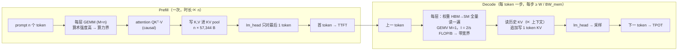

**公式与数量关系**

- Roofline：可达性能 $=\min(\pi,\ \beta\cdot I)$，拐点 $I_{ridge}=\pi/\beta$。RTX 4090 BF16 Tensor 峰值 165.2 TFLOPS、显存 1008 GB/s，$I_{ridge}\approx 164$ FLOP/B（Ada 白皮书，讲义 01 §3.2.2）。
- decode bs=1 的算术强度是**常数**：权重元素 $P$、每元素 $s$ 字节，FLOP $\approx 2P$、读 $sP$ 字节，$I = 2/s$。BF16 → 1.0 FLOP/B，FP8 → 2.0，W4A16 → 4.0，全部远低于拐点——量化改的是 roofline 上的位置，改不了"带宽受限"的定性。
- TPOT 下界：$\mathrm{TPOT}_{min} = W/BW_{mem}$（前提：稠密 decoder、无投机解码、$W \gg$ L2、bs=1）。RTX 4090 L2 72 MiB 与 GiB 级权重相差约 1:197，片上缓存对 decode 权重流没有意义（讲义 01 §3.2.1）。
- 余量去处：KV 读取项 $n \times 57{,}344\,\mathrm{B}/BW_{mem}$ 随上下文线性增长；launch/调度；带宽达成率。bs=1 每层 7 次 GEMV + 若干逐元素算子，28 层就是几百次 launch——这是 CUDA Graph 存在的理由。
- 指标定义：$\mathrm{TTFT} = T_{排队} + T_{prefill} + T_{首\,token}$；$\mathrm{TPOT} = (T_{总} - \mathrm{TTFT})/(N_{out}-1)$。TTFT 受 prefill 算力 + 排队 +（PD 时）KV 传输支配；TPOT 受权重带宽 + 主机侧派发支配。**同一个改动在两者上可以方向相反**。

**本项目的验证**

| 机制 | EXP | 看到了什么 |
|---|---|---|
| bs=1 TPOT 恒定、TTFT 随输入近线性 | EXP-004《B1 colocate 归因基线 + SLO 锁定》 | TPOT p50 15.87/15.93/16.34 ms（512/2K/8K 桶）几乎不变；TTFT 65.5 → 178.3 → 925.2 ms |
| TP2 只加速 decode 不加速 prefill | EXP-005《replica2/tp2 归因 + 功率帽节流调查》 | TPOT 16 → 9.3 ms（−42%），8K prefill 693.7 ms ≈ 单卡冷态 |
| PD 改变 TTFT 构成、不改 TPOT 下界 | EXP-007《B1 四臂 offered-load 扫描战役（协议 v2）》 | 四臂 TPOT 一致，TTFT 只有 pd1p1d 一臂翻倍以上 |
| 量化收益按 regime 分化 | EXP-016《D4 FP8 vs W4A16 同卡对比（Qwen3-30B-A3B，Ada SM89）》 | W4A16 decode 全 regime +23–48%；FP8 只在 c128 prefill 反超 |

## 1.2 KV cache：字节账、分页与 block table

**机制一句话**：KV cache 的大小由四个结构常数决定；vLLM 把它切成固定 16 token 的物理 block，请求只持有一张逻辑→物理的索引表——池的地址永不变，变的只是索引张量的内容，这既消了碎片，又满足 CUDA Graph 的地址稳定要求。

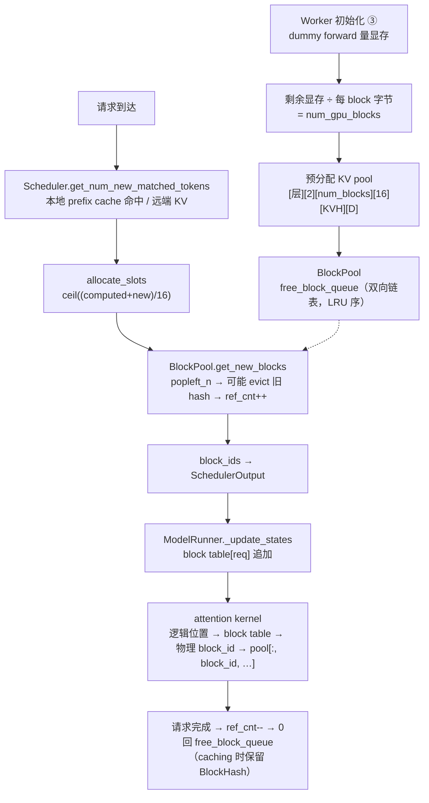

**公式与数量关系**

- 单 token KV 字节：$2 \times L \times KVH \times D \times s$（前面的 2 是 K 和 V 各一份）。Qwen2-7B：$2 \cdot 28 \cdot 4 \cdot 128 \cdot 2 = 57{,}344$ B。**最容易错的因子是 $KVH$**——用 `num_attention_heads`（28）代替 `num_key_value_heads`（4）会把整笔账放大 7 倍。
- 单请求：$B_{kv}(n) = n \times 57{,}344$，按 16 token 向上取整。8192 token → 469.8 MB，与 EXP-011《EXT-2 NixlPush 单点（推 vs 拉方向对照）》push 臂全量 469.8 MB 逐字节相符。
- 记账粒度 vs 传输粒度：一个 block $= 16 \times 57{,}344 = 917{,}504$ B；一个 NIXL descriptor $= 16 \times KVH \times D \times s = 16{,}384$ B；两者差 56 倍（$= L \times 2$，K 与 V 各注册成独立 region）。这个 56 是 §1.6 碎片化模型的核心常数。
- block_size = 16 的出处：PagedAttention 论文 §7.2 的扫描——"large enough to efficiently utilize the GPU and small enough to avoid significant internal fragmentation"。代价：论文 §7.1 attention kernel 比 FasterTransformer 慢 20–26%，换掉 §1 的 60–80% 显存浪费。
- D 端接远端 KV 的精确上界：`num_external_tokens = len(prompt) − 1 − num_computed_tokens`——最后一个 prompt token 必须由 D 本地算，因为需要它的 logit。prefix 可复用长度同理是 `input_len − 1`。

**本项目的验证**：EXP-006《pd1p1d 指标探针 + 归因 + NIXL 大传输实测》里 9 token 的探针请求报出 917,504 B（一整块，向上取整实证）；EXP-013《EXT-1 request 级 KV-wait 关联（解锁"KV 占 TTFT%"红线）》全部 36 请求 bytes 求和 7,398,752,256 B 与 Prometheus 计数器分毫不差；EXP-007 协议 v2 每点唯一 seed，就是因为 block hash 会让同 seed 的短桶 prompt 命中长桶的前缀（2048 桶实测 25% 命中）。

## 1.3 vLLM v1 引擎：请求生命周期与连续批处理

**机制一句话**：v1 引擎把前端（AsyncLLM）与核心循环（EngineCoreProc）拆成两个进程用 ZMQ 相连；核心循环每一步做四件事——调度、广播执行、等结果、更新状态——调度器**按 token 预算而不是按请求数**决定每轮 batch 的成员，这就是连续批处理。

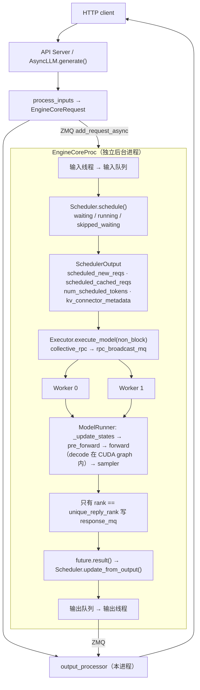

**关键结构**

- `EngineCore.step()` 四步：`scheduler.schedule()` → `execute_model(non_block=True)` → `future.result()` → `update_from_output()`。EngineCoreProc 维护输入线程与输出线程，把通信、序列化与模型执行重叠。
- Executor 三态 `uni / mp / ray`；`world_size = tp × pp × pcp`。`unique_reply_rank = world_size − tp_size`（最后一个 PP stage 的第一个 TP rank）——因为 TP 各 rank 在层末持有逐位相同的 logits，只需一个回传。
- Worker 初始化三阶段：Init Device（通信组、`InputBatch` 含 block table）→ Load Model（按并行策略切分，可选 `torch.compile`）→ Initialize KV Cache（dummy run 量显存 → block 数）。**KV 容量不是配的，是量的**。
- 连续批处理的四条状态转移：WAITING→RUNNING（准入）、RUNNING→FINISHED、RUNNING→WAITING（Retract：KV 不足时释放资源但保留输入与已生成 token）、WAITING→WAITING（预算未满足，`skipped_waiting` 不退回队尾）。准入按 token 预算分两本账的理由是 roofline：prefill 算力界（塞太多拖长单轮 forward，饿死 decode），decode 带宽/容量界。
- chunked prefill：把长 prompt 切成 token budget 大小的块跨 step 执行，与 decode 混批——防止长 prompt 独占一整轮 forward。
- 三种测量模式对应三个排队学量：attribution（并发 1，调度器完全旁路，测服务时间 $1/\mu$）、saturation（测 $\mu_{max}$）、sweep（测 $\lambda < \mu$ 的响应曲线）。goodput = 同时满足 TTFT 与 TPOT 两条 SLO 的请求数 ÷ 墙钟。

**本项目的验证**：EXP-007 的 attribution / saturation / sweep 三模式与 goodput 曲线的过峰下降段（replica2 缓降、pd 贴地）；EXP-008《B3 有限版本对照（v0.17.1 vs v0.25.1 单实例）》的 +45% 只在 512 桶——"每请求开销敏感 regime"，无负载延迟与 decode 速度不变；EXP-014《D1 MoE decode 分解：吞吐-batch 曲线 + nsys kernel 占比》证实 decode 步跑在 CUDA graph 内（nsys 必须 `--cuda-graph-trace=node`）；EXP-012《vLLM 0.17.1 P2pNccl 两缺陷动态复现（1P1D 实机）》的 bug1 正是 chunked prefill 假设被 connector 的 assert 焊死。

## 1.4 互联三条路径与两参数通信模型

**机制一句话**：部署形态的本质是"用通信换组织"，通信有多贵形态就有多少自由度；本机的三条跨卡路径测的是三件不同的事——链路能不能直连、集合通信库怎么用这条链路、上层传输库以什么粒度用它——**三个数字不可互换**。

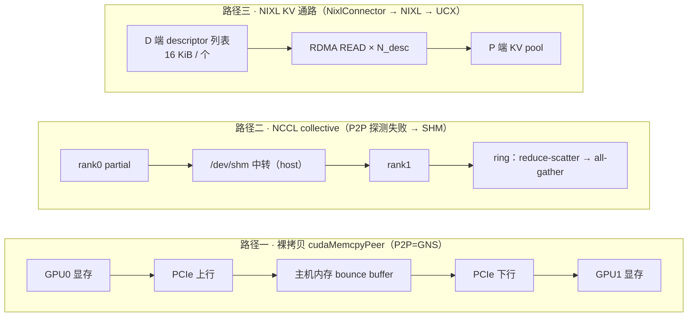

**公式与数量关系**

- 公理 B（Hockney）：任何一次搬运 $t(m) = \alpha + m/\beta$，有效带宽 $T(m) = m/(\alpha + m/\beta)$，半带宽消息长 $m_{1/2} = \alpha\beta$。**当 $m \ll \alpha\beta$ 时 $T \approx m/\alpha$，与 $\beta$ 无关——换更快的链路救不了小消息**。
- 路径一：无 P2P 时一次 GPU→GPU 拷贝变成两段 PCIe（上行 + 下行）经主机中转；单向被串行开销钉死，双向两段互相填流水。PCIe 4.0 x16 每方向规格 ≈ 31.5 GB/s。**单双向差约 25 倍是"无 P2P"的定量指纹**。
- 路径二：NCCL 在 P2P 不可用时走 SHM（host memory）；`NCCL_BUFFSIZE` 默认 4 MiB 解释带宽曲线从 1 MB 起平坦；AllReduce busbw $= \text{algbw} \times 2(n-1)/n$，两卡时二者相等（这个巧合只在 2 卡成立）。
- 路径三：软件栈最厚、粒度最碎（16 KiB descriptor），数字最小。从左到右，软件栈越厚、粒度越碎，数字越小。
- 三条路径的 $\alpha$ 与 $m$ 都不同——把大消息的 $\beta$ 拿去预测小消息的吞吐，是公理 B 明确禁止的操作。

**本项目的验证**：EXP-002 三个文件各排除一类替代解释（`topo -p2p r` = GNS；单向 D2D 0.60–0.91 vs 双向 22.6–22.8 GB/s；`all_reduce_perf` 曲线平坦）；EXP-018 补齐小消息端：延迟地板 ~14 µs（8 KiB 消息 13.79 µs），拐点结构 <16K 延迟主导 / 16K–256K 过渡 / ≥512K 带宽平台；EXP-006/007 反解路径三：0.26–0.27 GB/s 跨尺寸恒定。

## 1.5 张量并行 TP 的通信账

**机制一句话**：Megatron 切法——MLP 先列后行、attention QKV 列并行 + o_proj 行并行——每层前向只需两次 allreduce；decode 的小消息付的是**固定开销 $\alpha$**（延迟地板），prefill 的大消息付的是**带宽 $\beta$**（带宽墙），两者在同一条互联上表现完全不同。

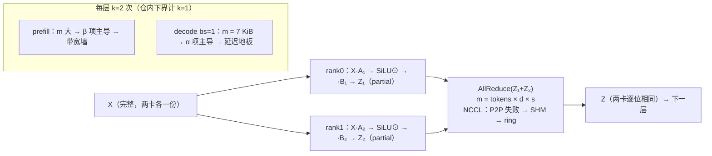

**公式与数量关系**

- 单次 allreduce 消息 $m = \text{本批 token 数} \times d \times s$。Qwen2-7B prefill 8192 token：$8192 \times 3584 \times 2 = 58{,}720{,}256$ B；decode bs=1：7168 B。
- decode：$\mathrm{TPOT}_{tp2} \approx \frac{W/2}{BW_{mem}} + k\,\alpha_{ar}$。7 KiB 按渐近带宽只要几 µs，实测每 token allreduce 代价是纯带宽项的数百倍——完全由 $\alpha$ 主导。可证伪推论：batch 增到 128 消息涨 128 倍而每步 allreduce 时间几乎不变，每 token 通信税按 batch 反比下降。
- prefill：$T_{tp2} \approx T_c/2 + L\,k\,t_{ar}(m)$，零加速条件 $L\,k\,t_{ar}(m) \ge T_c/2$。在本互联上 tp2 的 prefill 加速上限是 1.0×。
- Ring AllReduce 总传输 $2(N-1)K/N$（几乎与 $N$ 无关），轮次 $2(N-1)$ 随 $N$ 线性增长——小张量时固定开销占比上升。
- vLLM 的 custom allreduce 小消息路径依赖 peer buffer 直接读写，本机 P2P 禁用后只剩 NCCL SHM——**同一份代码在不同互联上走的是不同分支**。
- 微基准的 $\alpha$ 是下限：nccl-tests 是稳态循环，vLLM 的每步 allreduce 夹在 kernel 之间，真实系统里总是更大。本仓无 tp2 kernel 级 trace，这一条是登记在案的开放问题（讲义 01 §5.1.1）。

**本项目的验证**：EXP-005 decode 16 → 9.3 ms（权重带宽分摊 − 通信税，账闭合）、8K prefill 零加速（28 层 × 58.7 MB 大消息）；EXP-007 tp2 饱和吞吐仅 +13–19%（decode 收益批量化后被稀释、prefill allreduce 墙成主导）；EXP-014 AllReduce 在 bs=1/32 下恒占 13.8%/15.0%（TP2 固定税）；EXP-018 延迟地板 ~14 µs 与 llm-engine#EXP-D22 的 88 µs 拆成 14 µs 传输 + 74 µs 调度/同步。

## 1.6 PD 分离全链路：NIXL pull 与 KV 传输时间模型

**机制一句话**：PD 分离的价值主张只有两条——消除 prefill 对 decode 的干扰、P 池与 D 池独立扩缩；代价只有一条但很硬——**KV 必须搬家**。vLLM v0.25.1 的 NIXL pull 通路 = 控制面显式身份三元组交接 + 数据面 descriptor RDMA READ，而 descriptor 粒度由 connector 的 region 划分决定，不是 NIXL 参数。

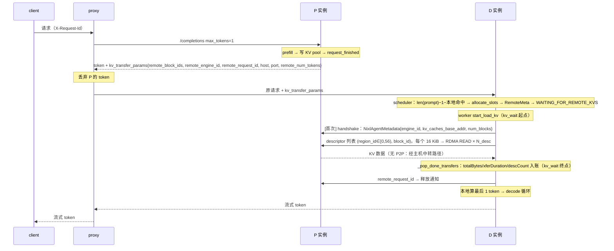

**六段时间轴**（EXP-013 的分解口径）：`pre_proxy | p_segment | gap_p_to_d | d_pre_kv | kv_wait | post_kv`，望远镜求和 $\Sigma_6 = \mathrm{TTFT} - (t_{ps} - t_r)$，残差是 proxy 内部 `await request.json()` 段——结构性的、必然为正的、可具名的。

**公式与数量关系**

- 朴素模型：$t_{xfer} = B_{kv}(n)/BW_{eff}$；容量上限 $\mathrm{req/s}_{max} \approx BW_{eff}/B_{kv}(n)$。成立三条件：传输在关键路径上（pull 语义下 WAITING_FOR_REMOTE_KVS 是定义）、传输资源被串行占用、不存在更早的瓶颈。排队论表述：串联队列吞吐由最慢站决定。
- 碎片化模型：$T_{kv} = N_{desc} \times t(m_{desc})$，$N_{desc} = 56 \times \lceil n/16 \rceil$，$m_{desc} = 16{,}384$ B 恒定。**传输时间对 descriptor 计数线性，而不是"带宽 × 时间"**；16 KiB 落在 $m_{1/2} = \alpha\beta$ 之下——这就是碎片化的精确含义。合并 descriptor 后天花板不再是 $\alpha$ 而是链路单向带宽：改 $m$ 有 2–3× 空间，改协议只有 10% 空间。
- 净收益判据：$\Delta = \Delta t_{interference}(\lambda) - t_{xfer}(n) - o_{handshake} - o_{proxy}$。并发 1 时右边恒为 0（没有干扰可消除），满负载时左边才可能爆炸——**PD 只在"干扰成本 > 搬运成本"时值得**。
- 课件判据：$\text{PD 可取} \iff \frac{2 L H_{kv} D S \cdot 2}{BW_{interconnect}} \ll T_{prefill}$。
- 统一账本：$\mathrm{TTFT} \approx T_{prefill}(n)/C + L\,k\,t_{ar} + B_{kv}(n)/BW_{eff} + o$；$\mathrm{TPOT} \approx \frac{W/C}{BW_{mem}} + \frac{B_{kv}(n)/C}{BW_{mem}} + L\,k\,t_{ar} + o'$。
- Splitwise 逐层重叠的上界是 prefill 本身：互联能力不够时，重叠优化只能改善常数，改不了结论。int8 压缩 KV 把分子除以 2，仍然是灾难——这恰好证明问题量级不在压缩能解决的范围内。

**旧架构 P2pNccl（v0.17.1）为什么死**

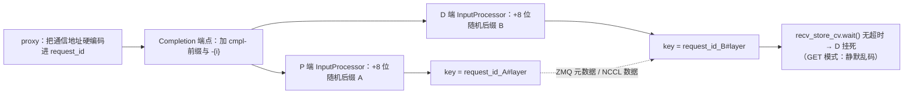

两端**独立推导**同一个 `request_id#layer` key 是隐式契约，InputProcessor 的随机后缀让 key 分叉；chunked prefill 则靠 `connector:433` 的 assert 焊死"P 上任何多步执行都是 prefill 续传"。正确形态是显式身份交接：由一端生成 rendezvous key 并显式传给另一端——这正是 NIXL 版 `kv_transfer_params` 的做法。

**本项目的验证**：EXP-001《NIXL 1P1D smoke 与版本裁决》（smoke 点落在小传输延迟地板上）；EXP-006（有效吞吐跨尺寸恒定；bytes 反解与 ext_kv 计数器对账）；EXP-007（容量上限式在三桶的预测精度随输入长上升）；EXP-011（换方向只改常数项 −6.7%，量级不变）；EXP-012（bug1 原生 traceback、bug2 wchan 闭环）；EXP-013（request 级因果占比 54.2/62.5/64.2%；每 descriptor 耗时跨桶几乎恒定；首请求握手成本直接观测；打 patch 前后 TTFT 噪声内）。

## 1.7 MoE：dispatch 链、fused_moe kernel 与 config tuple

**机制一句话**：一次 MoE 层 forward（vLLM fused_moe Triton 路径）= routing → moe_align_block_size → grouped GEMM（w1）→ 激活 → grouped GEMM（w2 × 路由权重）→ moe_sum →（TP>1）allreduce；vLLM 走**隐式 permute**——不搬 hidden_states，只建索引，让 kernel 按索引读原始输入。

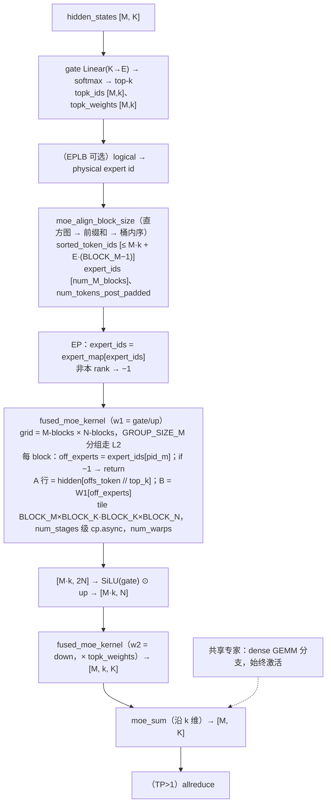

**config tuple 的两层查表**

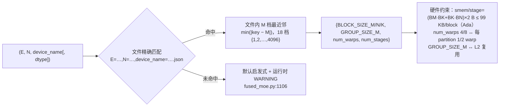

**公式与数量关系**

- E/N 由并行方式决定：EP 把 60 专家切到 2 卡（每卡 E=30，N=1408）；非 EP 每卡持全部专家但 N 减半（E=60，N=704）——GEMM 形状不同，tile 最优解不同，是两个独立 tuple。
- 补齐代价：`max_num_tokens_padded = topk_ids.numel() + num_experts × (block_size − 1)`，每个专家最多浪费 $block\_size - 1$ 个槽位。
- 反转点机制：期望命中专家数 $E[\#] = 60\left(1 - (1 - 4/60)^B\right)$。每 step 要读的路由专家权重 ≈ 命中比例 × 全部路由专家字节，分摊到每 token 在 $B$ 小时按 $1/B$ 下降、$B$ 大时趋于常数；dense 侧没有这个结构，两条曲线必然相交。**换 top-2/128 的模型交点会右移——这个式子给的是可外推的机制，不是可外推的数字**。
- Amdahl 一阶：$\Delta_{e2e} \approx \Delta_{kernel} \times p$，$p$ 为 fused_moe 时间占比。前提：$p$ 口径一致、优化不改其余部分、kernel 加速在实际 M 分布上成立（离散基准与连续负载之间隔着一层查表）。
- EP 的实现不是换 kernel，而是在索引层打标记：非本 rank 的 expert_ids 标 −1，kernel 里 `if off_experts == -1` 直接退出。

**本项目的验证**：EXP-009《C1 Qwen1.5-MoE-A2.7B 上卡（TP2+EP）+ C2 运行时证据》抓到 `fused_moe.py:1106` 告警点名 `E=30,N=1408,device_name=NVIDIA_GeForce_RTX_4090.json` 缺失；EXP-014 反转点 bs≈8、fused_moe 18.7% → 56.4%、moe_align ≤4.1% 与 permute ≤0.5% 不值得动；EXP-015《D2 MoE config 调优：4090 BF16 两个社区空缺 tuple + 六件套验证》两端显著、中段打平，e2e +1.1–1.2% 与 $\Delta_{kernel} \times 56.4\%$ 折算自洽。

## 1.8 量化在 Ada（SM89）上的分派路径

**机制一句话**：同为 MoE，量化分派不同路径——W4A16（GPTQ/AWQ 类）走 Marlin；FP8 在 `oracle/fp8.py:103-122` 只对 capability 90/100 走快路径，SM89 落到 Triton block-scaled。量化改变 $s$ 从而改变 decode 的算术强度（$2/s$），但都仍在带宽受限侧；prefill 侧收益取决于算力路径。

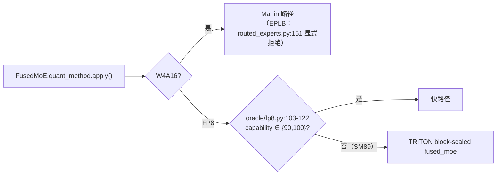

**本项目的验证**：EXP-010《C3 Qwen3-30B-A3B W4A16 上卡》日志确认 `MarlinLinearKernel`；EXP-016 日志 `symm_mem.py:66 Device capability 8.9 not supported` + `TRITON Fp8 MoE backend`；decode W4A16 全 regime +23–48%（4-bit 读取量减半）、prefill c128 TTFT FP8 反超（Marlin 反量化开销在计算受限时显形）、PPL FP8 7.663 vs W4A16 7.922（同 31,212 计分 token）。

## 1.9 EPLB：routing 之上的专家重排层

**机制一句话**：EPLB 位于 `select_experts()` 内 `fused_topk()` 之后的 `eplb_map_to_physical_and_record()`——logical → physical 专家映射 + 负载记录；重排改变 grouped GEMM 的专家分段与浮点归约顺序，因此会产生**数值性**输出分歧。

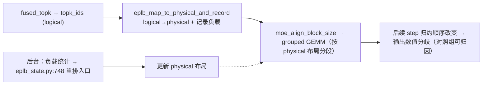

**本项目的验证**：EXP-017《D5 EPLB gate（W4A16 不支持 / FP8 真实重排 + 对照组归因）》——W4A16 被 `NotImplementedError: EPLB is not supported AutoGPTQMoEMethod` 显式拒；FP8 臂 2 次真实重排、balancedness 0.53–0.74；输出分歧经无 EPLB 对照组（逐字节一致）归因 EPLB。判定：gate 不过、不上简历、白板级保留。

---

# 第二部分 项目说明

## 2.1 硬件与环境

| 项 | 值 | 出处 |
|---|---|---|
| GPU | 2 × RTX 4090（消费级，GDDR6X，roofline 用 1008 GB/s） | EXP-002 / EXP-014 §1 |
| NVLink / P2P | 无 NVLink；`topo -p2p r` = GNS（驱动级禁用），connectivity matrix = 0 | EXP-002 §5 |
| 单向 / 双向 D2D | 0.60–0.91 GB/s / 22.6–22.8 GB/s；GPU 间延迟 14.5–15.9 µs；卡内 memcpy ~924 GB/s | EXP-002 §5 |
| PCIe | 双卡 Gen4 x16（空闲降 Gen1，负载升 Gen4） | EXP-002 / EXP-018 §2 |
| NCCL allreduce 小消息延迟地板 | ~14 µs（8 KiB 消息 13.79 µs） | EXP-018 §5 |
| NCCL allreduce 大消息带宽 | **停用待复核**（1.78 vs ~6.2 GB/s，见 §0 红线 2） | EXP-002 / 018 / 019 |
| NIXL KV 通路有效吞吐 | 0.26–0.27 GB/s（pull）；0.278–0.305 GB/s（push） | EXP-006 / EXP-011 |
| 功率帽 | 450 W SW Power Cap，持续 prefill SM 2820 ↔ 2460–2535 MHz，TTFT +30% | EXP-005 §5 |
| 驱动 / CUDA | 610.57.04 / 13.2；NCCL：venv wheel 2.28.9（系统全局 2.25.1，裸跑会静默落到它） | EXP-018 §2 |
| 容器限制 | `topo -m` 不可用；ptrace 受限（py-spy 不可用）；NCU 无计数器权限 | EXP-002 §7 / EXP-012 §4 |

| 环境 | 路径 | 版本 | 用途 |
|---|---|---|---|
| ENV-A | `/root/venvs/v0.17.1` | vLLM 0.17.1（PyPI） | B3 版本对照；P2pNccl 缺陷复现 |
| ENV-B | `/root/venvs/v0.25.1` | vLLM 0.25.1，sha 752a3a5044（带 EXT-1 16 行本地 patch） | 主战场：四臂、EXT、C、D1/D4/D5 |
| ENV-C | `/root/venvs/main` | main@7aa248fcfe（0.26.1rc1.dev） | D2 config 调优 / PR |

模型：Qwen2.5-0.5B-Instruct（smoke）、Qwen2-7B-Instruct（PD 线主模型，BF16 14.2 GB）、Qwen1.5-MoE-A2.7B-Chat（BF16 ~28.6 GB，60 专家 top-4）、Qwen3-30B-A3B-GPTQ-Int4（W4A16 ~16.5 GB）、Qwen3-30B-A3B-FP8（31 GB）。

## 2.2 四条实验线与问题定义

| 线 | 问题 | EXP |
|---|---|---|
| **部署四臂** | 多出一张同型号消费卡该怎么用：colocate / replica2 / tp2 / pd1p1d 在三个输入桶、统一 SLO 下比饱和吞吐、goodput、延迟分解，并把差距归因到硬件瓶颈；附版本对照 | 002 / 003 / 004 / 005 / 007 / 008 |
| **PD 分离** | NIXL 1P1D 在本互联上的可用性与版本裁决；KV 通路有效吞吐；"D 等远端 KV 占 TTFT 多少"能否从分量对账升级为 request 级因果占比；换传输方向能否翻盘；旧版 P2pNccl 两缺陷动态复现 | 001 / 006 / 011 / 012 / 013 |
| **MoE** | MoE 推理慢在哪、还能快多少：MoE vs dense 的 decode 吞吐-batch 曲线；nsys node 级分解定热点；为社区空缺的 4090 BF16 config 调优并六件套验证；EPLB 在量化 MoE 上的 gate | 009 / 014 / 015 / 017 |
| **量化** | Ada SM89 上 FP8 vs W4A16 的吞吐 / 精度 / 分派路径选型边界 | 010 / 016 |
|（横切）**硬件与通信基线** | 三条互联路径定量；allreduce 延迟地板与带宽复测；1.78 vs 6.2 GB/s 差异机制 | 002 / 018 / 019 |

## 2.3 仓库结构与证据制度

```text
vllm/experiments/
├── README.md            对外门面：定位 / 关键发现 / EXP 索引表 / 红线
├── LEDGER.md            对内账本：状态与措辞的唯一权威（证据台账、红线表、待办）
├── HANDOFF.md           接手入口（三行状态快照 + 环境 + 工装地图）
├── LAB_JOURNAL.md       顺写日记（四问：做了什么 / 为什么 / 关键数字 / 产物）
├── records/EXP-001…023  八节实验记录（§1 假设与阈值跑前锁定；§4 raw 指针；§6 实测/推断分开）
├── pd_disagg/           PD 线：scripts（run_point / collect_point / provenance）、results/b1_matrix（runs.jsonl + raw + snapshots）、ext1/（EXT-1 patch 与分析）、hw/、figures/fig1–7
├── moe_perf/            MoE 线：d1_* / d2_* / d4_* / d5_* 脚本、raw/EXP-014…017、figures、PR_DRAFT
└── docs/                theory（速查）/ lectures（深度讲义）/ talk（讲稿）/ 本文
```

**证据制度的六条**（来自 `/root/standards/CORE.md`，本仓是参照实现）：单一事实源（数字权威 = raw，状态权威 = LEDGER）；凡跑必录（八节 EXP + 日记四问）；raw 不可变（坏数据移 archive 不原地改）；首行 provenance（env / sha / cmd / date / gpu / driver）；主张有据（每句量化主张指到 gate 通过的证据，证据不足就降级措辞——所以有"措辞红线表"）；取不到就报错（gate 字段与指标同行，`gate_pass=false` 的行保留但不进图）。

**gate 五条件**（EXP-006 固化进 `collect_point.py`）：`nixl_failed = 0`、`nixl_expired = 0`、`nixl_xfers == completed == 预期远端请求数`、HTTP 全 200、bench 完整。gate 失败的点保留在 `runs.jsonl` 但不进 derived/ 与图。

---

# 第三部分 实验数据

> 每张表的数字**照抄记录 §5**，含轮数与口径限定语；列"指针"给的是记录编号，raw 路径在该记录 §4。四臂 = colocate（单卡混跑）/ replica2（两卡各一实例 + 轮询代理）/ tp2（TP=2）/ pd1p1d（1 prefill + 1 decode，NIXL pull）。

## 3.1 部署四臂

### 无负载归因基线（并发 1，32 请求/点，p50，ms）

| 桶 | colocate TTFT | replica2 TTFT | tp2 TTFT | pd1p1d TTFT | TPOT（四臂） | 指针 |
|---|---:|---:|---:|---:|---:|---|
| 512 | 65.5 | 65.2 | 62.8 | 214.4 | 15.9 / 15.9 / **9.3** / 15.9 | EXP-004 / 005 / 006 |
| 2048 | 178.3 | 173.5 | 173.5 | 554.6 | 15.9 / 16.0 / 9.4 / 15.9 | 同上 |
| 8192 | 925.2 | 714.6 | 693.7 | 2685.4 | 16.3 / 16.4 / 9.5 / 16.4 | 同上 |

**读法**：TPOT 只有 tp2 一臂变（16 → 9.3 ms，权重带宽分摊）；TTFT 只有 pd1p1d 一臂翻倍以上（KV 搬家）；8192 桶 colocate 925 vs replica2 715 的差是**功率帽**——单卡持续 prefill 降频，replica2 轮转维持 boost（EXP-005，稳态 ≈905 ms、冷启 ≈700 ms）。这张表是 v1 协议（有前缀缓存污染），v2 干净基线 2048 桶 ≈225 ms（EXP-007）。

### SLO 锁定（EXP-004，按 colocate 基线 p50 × 5，commit 后不回改）

TTFT ≤ 328 / 891 / 4626 ms（512 / 2048 / 8192），TPOT ≤ 50 ms。v2 发现 2048 桶实为 3.96×（891/225），预注册不回改，敏感性附录（fig6）覆盖 0.5–4×。

### 饱和吞吐与 goodput 峰值（EXP-007 协议 v2，84 有效测量点）

| 臂 | 饱和 req/s 512 / 2048 / 8192 | goodput 峰值 rps @ offered 512 / 2048 / 8192 |
|---|---|---|
| colocate | 10.36 / 3.63 / 0.90 | 8.57@9.3 / 2.41@2.7 / 0.43@0.68 |
| replica2 | 15.58\* / 7.00 / 1.78 | 12.75@14 / 4.96@5.3 / 0.90@0.95 |
| tp2 | 12.31 / 4.16 / 1.02 | 10.18@11.8 / 2.51@2.7 / 0.60@0.81 |
| pd1p1d | 7.84 / 2.12 / 0.54 | 1.59@5.2 / 0.16@1.8 / 0.11@0.45 |

\* 512 桶 replica2 疑受 SAT_CONC=64 或 rr_proxy 上限影响，2048/8192 为 1.93/1.98×（EXP-007 §7）。**复测（EXP-023，附录 D）：SAT_CONC=128 下 20.87 req/s，原值确系欠饱和，512 桶扩展效率同口径 1.63×**。


**读法**：replica2 全桶最高（长桶近完美 2×）；tp2 双卡只换来 13–19%（8K 归因仅 −5%）；pd1p1d 全负载段溃败——512 桶 66% 饱和度时 goodput 仅 1.59，8K 饱和 0.54 与 0.27 GB/s 传输墙理论上限 ~0.57 吻合。成本口径（GPU·s/req）colocate 单卡最优、replica2 打平、tp2/pd 负收益。选型结论：短请求 colocate×2（= replica2）；长上下文超单卡容量才考虑 tp2；**PD 在本互联上不可取**。

### 版本对照（EXP-008，v0.17.1 vs v0.25.1，单实例 colocate）

| 指标 | v0.17.1 | v0.25.1 | Δ |
|---|---:|---:|---:|
| TTFT p50 512 / 2048 / 8192（ms） | 66.4 / 225.4 / 929.6 | 65.4 / 224.9 / 925.2 | <1% |
| TPOT p50（ms） | 16.00 | 15.87 | <1% |
| 饱和 512 / 2048 / 8192（req/s） | 7.14 / 3.59 / 0.89 | 10.36 / 3.63 / 0.90 | **+45%** / ~0 / ~0 |
| 启动（s） | ~308 | ~58 | −81% |

只作 system-version comparison，不归因到单个组件（红线）。收益集中在每请求开销敏感 regime。

## 3.2 PD 分离

### NIXL 通路遥测（EXP-006，pull，并发 1）

| 桶 | bytes 总（GB） | MB/xfer | avg xfer (ms) | desc/xfer | 有效吞吐（GB/s） |
|---:|---:|---:|---:|---:|---:|
| 512 | 0.940 | 29.4 | 113.9 | 1792 | **0.26** |
| 2048 | 2.820 | 88.1 | 330.2 | 5380 | **0.27** |
| 8192 | 14.069 | 439.7 | 1602.7 | 26834 | **0.27** |

bytes ÷ desc = 16,384 B/descriptor（恒等式）；有效吞吐跨尺寸恒定 = 碎片化的签名（§1.6）。


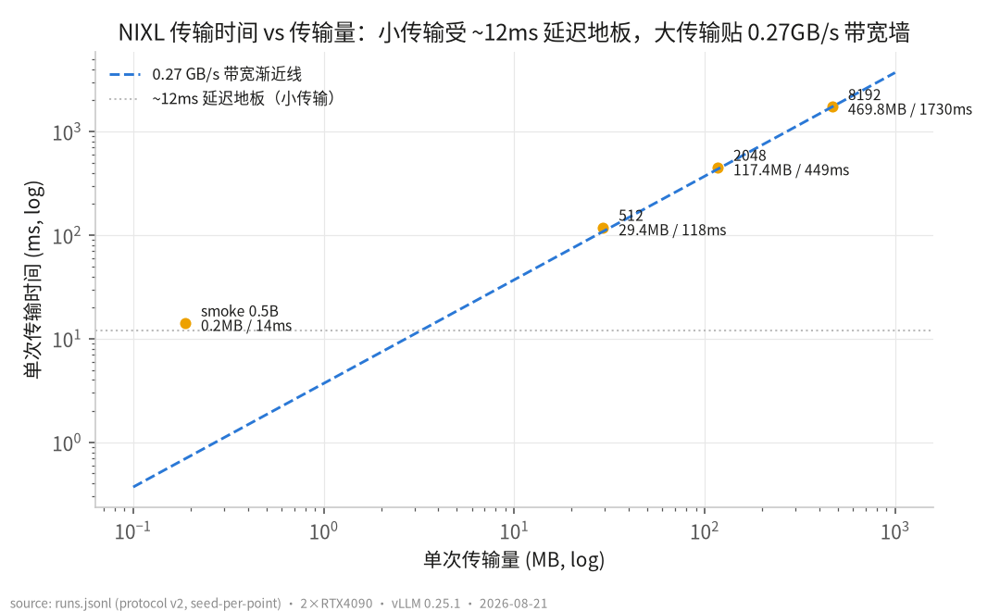

### request 级因果占比（EXP-013 EXT-1，并发 1，p50，每桶 n=11）

| 桶 | TTFT (ms) | kv_wait (ms) | **KV 占 TTFT** | p10–p90 | P 段（ms） | post-KV (ms) | 闭环误差 |
|---:|---:|---:|---:|---|---:|---:|---:|
| 512 | 218.3 | 118.2 | **54.2%** | 52.4–55.6% | 63.8 | 24.4 | 0.08% |
| 2048 | 726.7 | 455.7 | **62.5%** | 61.8–63.7% | 221.7 | 24.0 | 0.04% |
| 8192 | 2738.0 | 1763.8 | **64.2%** | 63.6–64.8% | 899.5 | 35.0 | 0.02% |

三重互证：Σbytes 7,398,752,256 = Prometheus 分毫不差；kv_wait − xferDuration = 0.3–1.9 ms；六段闭环误差 p50 <0.1%（逐请求最大 0.11%）。打 patch 前后 TTFT 218/727/2738 vs 219/719/2719（零扰动）。占比随输入饱和于 ~64%：P 段与传输同为 $O(n)$，短输入被 ~40 ms 固定开销稀释。

### 换方向（EXP-011 EXT-2，push 单点，同 seed）

8192 桶 TTFT 2718.7 → **2537.1 ms（−6.7%）**；有效吞吐 0.26–0.27 → 0.278–0.305 GB/s（+10–13%）；avg post 4 → 71–149 ms（posting 落到 P 端）。量级不变——**传输方向救不了 PD**。

### 旧架构缺陷复现（EXP-012，v0.17.1 P2pNccl，实机）

bug1：`connector:433` AssertionError（P 上 `max_tokens>1` + 地址串 id），裸直连先崩于 `:518`（实证修正静态分析）；bug2：PUT_ASYNC 下 P/D 随机后缀分叉 → D 在 `engine:317` 无超时 wait 挂死，全线程 `futex_wait`、util 0、P /health 恒 200。措辞限定：只写"复现 / 定位 / 验证"。

## 3.3 硬件与通信基线

| 量 | 值 | 状态 | 指针 |
|---|---|---|---|
| P2P | GNS，connectivity 0 | ✅ | EXP-002 |
| 单向 / 双向 D2D | 0.60–0.91 / 22.6–22.8 GB/s（差 25 倍 = 无 P2P 指纹） | ✅ | EXP-002 |
| NCCL allreduce 延迟地板 | ~14 µs（16 B–8 KiB 区间 13.5–14.2 µs） | ✅ | EXP-018 |
| NCCL allreduce 大消息 | 1.78（8/21）vs 6.20 avg / 6.40–6.50 平台（8/29）GB/s | ⚠ 停用待复核 | EXP-002 / 018 / 019 |
| 差异机制 | NCCL 自报 `Using network Socket` + `falling back to /dev/shm`；单点对照 SHM 3.96 vs Socket 0.76 GB/s；计时口径干净 | 终端级证据 | EXP-019 |

EXP-019 §8 的复现四步与 EXP-018 缺的 half dtype 已补跑，结果见附录 D（EXP-020《NCCL 旋钮矩阵复现 1.78 GB/s》/ EXP-021《NCCL allreduce dtype 扫描》）：Socket 路径落窗、SHM 路径亦见塌陷，**定因不唯一**。

## 3.4 MoE

### 吞吐-batch 曲线（EXP-014 D1，TP2+EP，输入 128 / 输出 256）

| 并发 | MoE tok/s | dense tok/s | MoE/dense | MoE TPOT (ms) | dense TPOT (ms) |
|---:|---:|---:|---:|---:|---:|
| 1 | 221 | 109 | **2.03×** | 4.40 | 9.06 |
| 4 | 538 | 398 | 1.35× | 7.21 | 9.78 |
| 8 | 726 | 748 | **0.97×（反转点）** | 9.93 | 10.26 |
| 32 | 1691 | 2094 | 0.81× | 18.33 | 14.06 |
| 128 | 3975 | 4827 | **0.82×** | 30.63 | 23.39 |


### nsys node 级 kernel 分解（EXP-014，双 rank 合计，20 s 稳态窗）

| 类别 | bs=1 | bs=32 |
|---|---:|---:|
| grouped GEMM（fused_moe） | 18.7% | **56.4%** |
| dense GEMM/GEMV | **40.9%** | 14.9% |
| AllReduce | 13.8% | 15.0% |
| attention | 7.2% | 7.1% |
| norm/rope/act/elementwise | 8.7% | 3.7% |
| routing | 4.9% | 1.1% |
| moe_align_block_size | 4.1% | 1.0% |
| permute/unpermute/moe_sum | 0.5% | 0.3% |

bs=1 roofline：MoE 221/~373 tok/s（59%），dense 109/~142（77%）。方法学陷阱：默认 `--cuda-graph-trace=graph` 会把 CUDA graph 内的 decode kernel 全部藏掉，首采 bs=32 表实为 prefill 混样，必须 `node` 级。

### config 调优（EXP-015 D2，两个社区空缺 tuple）

| 臂 | M=1 | M=8–64 | M=128 | M=256 | 口径 |
|---|---:|---:|---:|---:|---|
| EP（E=30, N=1408） | 38.2 → 34.9 µs（**−8.5%**） | ~0 | −3.9% | −3.8% | 单轮 |
| EP 三轮 hardening | 38.1±0.0 → 35.0±0.2（**−8.2%**） | −0.1 / +0.1 / −0.9% | −3.9% | −3.8% | mean±std |
| 非 EP（E=60, N=704） | 24.4 → 23.4（**−3.8%**） | ~0 | −3.7% | −3.3% | 单轮 |
| 非 EP 三轮 | 24.4±0.1 → 23.5±0.1（**−3.6%**） |— | −3.7% | −3.4% | mean±std |

correctness：`test_moe.py::test_fused_moe` 120 passed / 120 skipped；全文件子集 1041 passed / 127 skipped / 0 failed。e2e TPOT +0.8–1.2%（c1/c32/c128）与 $\Delta_{kernel} \times 56.4\%$ 折算一致，但低于跨会话漂移 ±5–8%，**不作 headline**（LEDGER 🚫）。D3 判定：中段打平说明 Triton tile 空间已被启发式覆盖，config 即最优杠杆。大 M 档（512–4096）独立复测见附录 D（EXP-022）：−2.8~−14.0% 全段显著。上游 PR：vllm-project/vllm#54372（2026-08-29 提交，OPEN 未合并）。

### EPLB gate（EXP-017 D5）

W4A16：`NotImplementedError: EPLB is not supported AutoGPTQMoEMethod`（`routed_experts.py:139-152`）。FP8：2 次真实重排，balancedness 0.53–0.74；输出分歧（token 级）vs 无 EPLB 对照组逐字节一致 → 因果归属 EPLB。判定不上简历。

## 3.5 量化（EXP-016 D4，Qwen3-30B-A3B，TP2+EP）

| 点 | FP8 tok/s | W4A16 tok/s | Δ | FP8 TPOT | W4A16 TPOT | FP8 TTFT | W4A16 TTFT |
|---|---:|---:|---:|---:|---:|---:|---:|
| attr512 (c1) | 132.6 | 186.4 | +41% | 7.10 | **4.91** | 57.3 | 58.3 |
| c1 | 139.3 | 201.3 | +44% | 7.12 | **4.91** | 21.2 | 16.6 |
| c32 | 1455.3 | 2160.0 | +48% | 19.93 | **13.77** | 258.3 | 241.1 |
| c128 | 3574.0 | 4393.9 | +23% | 33.81 | **26.76** | **497.1** | 612.8 |

PPL（wikitext-2-raw，同 31,212 计分 token）：FP8 **7.663** vs W4A16 **7.922**。权重 31 G vs 16 G。结论限 128/512 输入（未扫 2K/8K）。

## 3.6 措辞红线表（LEDGER 当前状态）

| 红线 | 状态 | 依据 |
|---|---|---|
| "P2P 受限" | ✅ | EXP-002 topo + connectivity 矩阵 |
| "社区空缺"（MoE config） | ✅ | `moe_configs/DEDUP.md` 两次远端复核 |
| "KV 传输占 TTFT X%" | ✅ | EXP-013 request 级三段关联 |
| telemetry 带宽表述 | 限定 | 只称 telemetry-derived effective throughput |
| 0.17 两 bug | 限定 | 只写"复现 / 定位 / 验证" |
| A/B 版本对照 | 限定 | 只称 system-version comparison |
| PR 状态 | 限定 | 已提交（#54372）可写"提交"；未合并不写"合入" |
| D2 e2e +0.8–1.2% | 🚫 不作 headline | 低于跨会话漂移 |
| EXT-1 patch 定性 | 限定 | "~16 行本地可观测性改动" |
| NCCL collective 带宽具体值 | ⚠ 停用 | 复现 1.78 前两值均不作权威 |

---

# 第四部分 分析：为什么可以这么分析，原理是什么

> 第三部分的每个数字背后都有一个"凭什么这么读"的方法。本部分把这些方法抽出来，每条给：**原理 → 本仓怎么做的 → 反例（不这么做会错在哪）→ EXP**。

## 4.1 先判 bound，再分层读数字

**原理**：一个数字只有放在它所属的层（roofline 位置、互联路径、软件栈厚度）里才有意义。三条跨卡路径的 $\alpha, m, \beta$ 各不相同，把路径二的 $\beta$ 拿去预测路径三的吞吐是公理 B 禁止的操作（§1.4）。

**本仓怎么做**：EXP-002 一开始就测三个数而不是一个；EXP-006 拿到 0.26 GB/s 后先与 EXP-002 的单向裸拷贝 0.60–0.91 GB/s 比量级，判定"落在无 P2P 单向路径的下方一档、被 descriptor 碎片化再压一层"，而不是与双向 22.7 GB/s 比。

**反例**：用 PCIe 4.0 x16 的 31.5 GB/s 规格去算 KV 传输时间，会得出 8192 token 只要 15 ms——实测 1603 ms，差 100 倍。错在层级：规格是 $\beta$，实际付的是 $N_{desc} \times \alpha$。

## 4.2 归因的三级证据：分量对账 → request 级关联 → 闭环误差

**原理**：把一个总量拆成分量有三个强度等级——(a) 用不同来源的分量凑总量（对账，推断级）；(b) 让每个分量与总量在同一 request identity、同一时钟域下逐条关联（因果级）；(c) 分量求和与总量的残差可具名、必然为正、小于测量分辨率（完整性检验）。**闭环误差是完整性检验，不是精度检验**——它证明没有漏掉的段，不证明每段测得准；测得准靠另外两条链。

**本仓怎么做**：EXP-006 先做（a）：8K TTFT 2685 ≈ P prefill ~900 + xfer 1603 + D 首步/代理，得"传输占 54–64%"，但红线只允许写推断。EXP-013 打 16 行 patch 做（b）+(c)：client 自定 `X-Request-Id` 原样贯穿 proxy/P/D，`perf_counter` 计时长、`time.time()` 跨进程对齐，六段求和残差 = proxy 内 `await request.json()`；三重互证——账目链（Σbytes = Prometheus）、边界链（kv_wait ≈ xferDuration）、完整链（闭环 <0.1%）——三条各留一个漏洞但互不重叠。这时红线才从 🚫 变 ✅，EXP-006 的对账值被"追认"。

**反例**：只做（a） 就写"KV 传输占 TTFT 64%"，面试官追问"P 段的 900 ms 是同一批请求测的吗"就答不上——它来自另一次跑、另一个热工况。

## 4.3 对照组与隐藏变量

**原理**：任何"A 比 B 快"都可能是第三个变量在起作用。三种隐藏变量本仓都撞过：设备状态（功率帽）、被测系统有状态（前缀缓存）、测量工具的默认行为（nsys graph 级）。对策是同一条：**先证明测量协议在无处理组时稳定，再归因**。

| 隐藏变量 | 现象 | 怎么发现的 | 对策 | EXP |
|---|---|---|---|---|
| 功率帽 | 8K 桶 TTFT 双段分布（前 8 请求 ~700，其后 ~900 ms）；replica2@8K 反而比 colocate 快 | 三次诊断跑 + 1.5 s × 40 轮遥测：450 W SW Power Cap（0x4），SM 2820 ↔ 2460–2535 MHz，63 °C 排除热因 | run_point.sh 加 2 s GPU 遥测入 runs.jsonl；headline 以 sweep（满负载各臂同为持续态）为准；attribution 引用带工况标注 | EXP-004 §7 / EXP-005 |
| 前缀缓存污染 | 同 seed 下短桶 prompt 是长桶的精确前缀，2048 桶 25% 命中、8192 桶 8.6% | 单请求探针 bytes 比公式少一块；逐块对账 | 协议 v2：每点唯一 seed（attribution x042 / saturation x099 / sweep x001–x006），跨臂同点位同 seed；v2 干净基线 2048 桶 178 → 225 ms | EXP-006 / EXP-007 |
| nsys graph 级 | 首采 bs=32 的 fused_moe 只有 384 实例（= 4 个 prefill step） | 实例数与 step 数对不上 | `--cuda-graph-trace=node`；graphlevel 文件保留作方法学证据 | EXP-014 §7 |
| Triton JIT | 装新 config 后首个 c32 bench TTFT 1021 vs 176 ms | c128（后跑）正常，佐证一次性 | warmup 后复测；PR 正文注明 | EXP-015 §7 |
| 工装静默 bug | `[ cond ] && f \|\| g` 让两臂跑了同一配置 | hardening 时每臂断言 config 来源日志 | 改 if/else + 双重断言 | EXP-015 §5.1 |
| EPLB 归因 | 开 EPLB 后输出分歧 | 单独一臂无法区分"EPLB 导致"与"负载本身导致" | 无 EPLB 同负载对照组逐字节一致 → 归因成立 | EXP-017 |

## 4.4 预注册与可证伪

**原理**：假设、判定阈值、SLO 在跑之前锁定并 commit，跑完不改——这是把"事后挑阈值"这个最常见的自欺关掉的唯一办法。负结果与被证伪的假设同样入账，因为它们同样是信息。

**本仓怎么做**：EXP-004 的 SLO 按 colocate 基线 × 5 换算后 commit；v2 发现 2048 桶实为 3.96× 也**不回改**，只在敏感性附录（fig6，0.5–4×）覆盖。EXP-019 跑前写下"扣除混入物后收敛到 <10% → 计时口径问题；否则升级真实环境差异"。EXP-015 七条跑前预测四条成立、两条被推翻、照记。EXP-017 gate 不过就不上简历。EXP-012 实机发现裸直连先崩于 `:518` 而非静态分析预言的 `:433`——实证修正静态分析，照记。

**反例**：EXP-002 的 1.78 GB/s 当时只写了 `env=n/a sha=n/a`，没记 NCCL 环境变量、PCIe 运行态、NCCL_DEBUG 日志——8 天后复测得 6.2 GB/s 就无法回溯定因。这条教训被写进记录 §7 并升级成硬约定："硬件测量的 provenance 必须记录 NCCL 环境变量、PCIe 运行态、NCCL_DEBUG 日志"。

## 4.5 从 kernel 到端到端的折算

**原理**：kernel 级加速比 $\Delta_{kernel}$ 进到端到端只剩 $\Delta_{kernel} \times p$（Amdahl 一阶），$p$ 是该 kernel 的时间占比。所以**优化对象必须由占比数据锁定，而不是预设**；而 $p$ 本身随 regime（batch、输入长）变化。

**本仓怎么做**：EXP-014 先测占比（fused_moe 18.7% @ bs=1 → 56.4% @ bs=32；moe_align ≤4.1%、permute ≤0.5%），据此 EXP-015 只调 config；kernel M=1 −8.5% 折到 e2e 只剩 +1.1–1.2%，与 $\Delta \times 56.4\%$ 吻合——**折算自洽本身就是证据链的一环**。反过来，e2e +1.2% 低于跨会话漂移 ±5–8%，所以主证据是 kernel A/B（3 轮 mean±std），e2e 只作方向印证，不作 headline。

**反例**：D1 之前的直觉是"MoE permute 该优化"（triton-kernels 仓做过 12.5×）；占比数据说它只有 0.5%——12.5× 折到 e2e 不到 0.5%。数据把这条路直接关掉了。

## 4.6 测量效度

**原理**：先问"这个数测的是它宣称的那件事吗"，再问"它有多准"。效度问题不能靠多跑几轮解决。

| 效度陷阱 | 本仓的规则 | EXP |
|---|---|---|
| 无 raw 的数字 | 降级为"终端级证据"，记录里写完整命令与数字，永不进 README 表 | EXP-005 diag×3 / EXP-008 v0171 日志 / EXP-019 |
| profiler 环境的时延 | 永不进 benchmark 表；占比是窗内相对值 | EXP-014 |
| 对照物身份 | 版本对照只称 system-version comparison；A/B 每臂断言 config 来源 | EXP-008 / EXP-015 |
| 单轮 vs 多轮 | 进 README/简历的关键数字 ≥3 轮 mean±std，交叉次序抵消热漂移 | EXP-015 hardening |
| 库版本静默回退 | NCCL 显式 `LD_LIBRARY_PATH` 指向 venv wheel 2.28.9（否则落到系统 2.25.1） | EXP-018 |
| 臂名匹配 | 用前缀不用全等（`pd1p1d_push` 被 `== "pd1p1d"` 漏掉） | EXP-011 |
| 超时窗 | 按最慢臂设（GPTQ-Int4 加载 11 min > 10 min 健康检查窗） | EXP-016 |

## 4.7 分析模板：拿到一个新数字先问的五个问题

1. **它在哪一层**——roofline 的哪一侧？哪条互联路径？软件栈多厚？（§4.1）
2. **它的对照物是谁、在不在同一层**——同热工况？同 seed？同版本？对照物自己也跑了多轮吗？（§4.3、§4.6）
3. **它是实测还是推断**——有 raw 吗？有 provenance 吗？是分量对账还是 request 级关联？（§4.2、§4.6）
4. **它的 regime 边界在哪**——换 batch / 输入长 / 模型 / 互联，结论还成立吗？哪个 EXP 的 §7 写了边界？（§4.5）
5. **它推翻了什么**——跑前的假设是什么？如果没推翻任何东西，这个实验的设计有问题。（§4.4）

---

# 第五部分 面试问题与解答（分类）

> 九大类 140 问。格式固定：**问** → 答（要点 + 指针）→ 追问链（②③ 是第二、三层）。带「Q 卡」标记的是仓内 `knowledge/interview/` 已定稿的口径，核心句逐字保留。两处口径按 LEDGER 当前状态统一：NCCL collective 带宽只写"受限、待复核"，不报具体 GB/s；PR 写"已提交 #54372、OPEN 未合并"。答案里凡"材料未覆盖"的追问，是本仓没做过的事，答的时候要说"这个我没做，通用知识上……"。

## A 系统架构（vLLM v1、调度、KV 管理）

**A1 把 vLLM v1 从 HTTP 请求到 token 输出的调度链画出来，每个环节的数据结构是什么。**

HTTP POST → `X-Request-Id` 取 request_id（`serving.py:117`）→ AsyncLLM 进程 tokenize → `EngineCoreRequest` → ZMQ IPC → EngineCore 独立进程 `step()` → `Scheduler.schedule()`：waiting 经 `allocate_slots` 进 running，每 step 重组 batch（continuous batching）、长 prompt 按 token 预算切块（chunked prefill）、block hash 命中免算（prefix caching）→ `SchedulerOutput{scheduled_new_reqs, scheduled_cached_reqs, num_scheduled_tokens, kv_connector_metadata}` → Worker（TP 每 rank 一进程）forward（FlashAttention + paged KV）→ sample → `ModelRunnerOutput` → `update_from_output()` 检测 stop、free blocks → ZMQ → detokenize → SSE。（whiteboard/01；§1.3 图）

- ② 为什么 EngineCore 要独立进程？→ 输入/输出线程把通信、序列化与执行重叠；`rpc_broadcast_mq` 广播、只有 `unique_reply_rank` 回传（§1.3）。③ TP 时哪些进程参与？→ `world_size = tp × pp × pcp` 个 Worker 进程，每进程一张卡。

**A2 waiting → running 的准入判据是什么？**

准入即显存承诺：`allocate_slots` 拿不到 block 就不进 running；按 token 预算而非请求数，因为 prefill 算力界、decode 带宽/容量界两本账不同（§1.3）。

- ② running 中显存不够怎么办？→ Retract：释放资源但保留输入与已生成 token，成本是重算被 evict 的部分（材料只给状态转移，抢占策略细节需通用知识）。③ PD 下 D 端准入多了什么？→ 先扣本地 prefix 命中，再标 `reqs_to_recv`，进 WAITING_FOR_REMOTE_KVS。

**A3 KV block 为什么是 16 token？谁定的？**

vLLM 默认值，依据 PagedAttention 论文 §7.2 的扫描。本仓三个数字由它决定：917,504 B/块（EXP-006 单请求探针实测）、8192 token = 512 块整除、非对齐 prompt 向上取整（9 token 报一整块）。魔法数归类：实测扫描、可配置。

- ② paged 的代价？→ attention kernel 慢 20–26%，换 60–80% 显存浪费。③ 块太小/太大各失效在哪？→ 太小打不满 GPU 并行度，太大内部碎片上升、共享概率下降。

**A4 chunked prefill 在调度链哪一层？**

`num_computed_tokens` 游标；长 prompt 不独占 step，与 decode 混批控 TTFT/TPOT 平衡。

- ② 它和 PD 分离是不是解决同一个问题？→ 是（prefill 阻塞 decode），Sarathi-Serve 的 stall-free 调度零跨卡成本，在互联受限平台上原理上应优于 PD；**本仓四臂没做该开关对照臂，是设计的真实缺口，不主张任何相关数字**（讲义 01 §8.2）。③ 0.17 P2pNccl 为什么与 chunked prefill 冲突？→ 见 B13。

**A5 prefix caching 怎么工作？它怎么把你的 benchmark 污染了？**

block hash 命中免算。污染：固定 seed 下 512 桶 prompt 恰是 2048 桶的精确前缀，2048 桶 25% 命中、8192 桶 8.6%；两个独立计数器（bytes 反解 token vs `prompt_tokens_by_source_total`）对账才发现"数字看起来完全正常"的表是脏的；代价 colocate 全套重跑，干净 2048 基线 178 → 224.9 ms，差值精确等于缓存效应（EXP-006 §7、EXP-007）。

- ② 为什么"每点唯一 seed"比"全局固定 seed"更可复现？→ 可复现靠"每点唯一且记录在案的 seed"，固定 seed 让缓存跨运行命中、prefill 工作量凭空少四分之一。③ 生产环境正相反——前缀共享是常态，cache-aware 路由会让 replica2 更强。

**A6 PD 分离的 connector 挂在调度链哪里？改不改主循环？**

只是调度器的旁路元数据 `kv_connector_metadata`，不改主循环；v1 拆 scheduler 侧（决定谁远端拉）+ worker 侧（执行传输），失败可回退 `failure_policy`；0.17 P2pNccl 则在 worker 层 hook 里做、身份靠字符串约定（whiteboard/01）。

- ② D 端请求何时开始计 kv_wait？→ `start_load_kv` 首见到全部 handle DONE（EXP-013）。

**A7 CUDA Graph 在 decode 里扮演什么角色？对你的实验有什么影响？**

四臂全部未加 `--enforce-eager`，graph 生效把 launch 项压到最低（bs=1 每层 7 次 GEMV，28 层几百次 launch）。影响：nsys 默认 `--cuda-graph-trace=graph` 把图内 decode kernel 整个吞掉（EXP-014 §7）。

- ② Graph 加速比怎么估？→ ≈ 1 + T_host/T_kernel，"倍数衡量的是坑的深度不是解法的质量"：自家 Triton 路径 11.6× vs NVIDIA 博客 2.8×，kernel 时间几乎一样，差在 Python 分发 36 µs vs C++ 6 µs（triton-kernels#EXP-T05）。③ Graph 与 NIXL 能共存吗？→ 实测通过，机制是 KV 收发挂在装饰器上、不启用时零开销。

**A8 continuous batching 的原理？你研究了吗？**

Orca 的 iteration-level scheduling 把调度粒度从"请求"降到"迭代"；selective batching 把 Attention 之外算子按 token 拉平、Attention 逐请求算。本仓所有臂都跑在这套范式之后的 vLLM 上，"享受它但不研究它"；EXP-008 的 +45%@512 测的是范式之上的工程演进。

**A9 一个 request_id 在 vLLM 里会被改写几次？**

四层链：外部 id → InputProcessor 追加 8 位随机后缀（`input_processor.py:212`）→ connector 用内部 id 拼 key。EXT-1 靠 client 自定 `X-Request-Id` 贯穿 proxy/P/D（`serving.py:117`）+ D 端同时打印本地 req_id 与 remote_request_id 做 join（EXP-013）。

- ② 这条链怎么把 0.17 弄死的？→ B13。③ 生产怎么做？→ 网关强制注入 trace id 逐跳透传、OpenTelemetry span。

**A10 vLLM 升级一个大版本能带来多少收益？（Q 卡）**

我做了个有限范围的对照，先说口径：只称 system-version comparison，单实例、同 workload、同协议同 seed，不归因到任何单个组件——因为 0.17.1 到 0.25.1 之间 scheduler、API server、默认参数全变了。结果是：无负载延迟和 decode 速度八个月间几乎没动（TTFT Δ<1%、TPOT 16.00 → 15.87 ms），因为那是权重带宽和计算的物理上限；但 512 桶的饱和吞吐从 7.14 涨到 10.36 req/s，+45%——收益集中在每请求开销敏感的 regime，2048/8192 这两个计算受限桶是零差异。附带一个工程体验数字：服务启动 308 s → 58 s。另外这个对照做不成 PD-vs-PD，因为 0.17.1 的 P2pNccl 在默认配置下正常请求就会触发 D 实例挂死，它根本不构成可用的对照臂，所以那一维的结论只能写"不可用 vs 可用"。（EXP-008、EXP-012）

- ② 为什么不归因？→ 红线明确禁止（有意不答而不是答不出）。③ 另一例版本差异？→ profiler 接口从 env var 改成 `--profiler-config.profiler`（EXP-003）。

**A11 TTFT 里除了 prefill 和传输还有什么？**

短输入时 ~40 ms 固定开销（HTTP/调度）稀释占比，所以 KV 占比 512 桶 54.2% < 8K 64.2%；首请求另有 ~300 ms 一次性 NIXL handshake（512 桶首请求 kv_wait 比后续高 292 ms，EXP-013 idx=0，必须单列不进统计）。

## B PD 分离与 KV 传输

**B1 PD 分离现在这么热，你为什么说它在你的平台上不可取？怎么证明瓶颈就是传输？（Q 卡）**

先给量级：pd1p1d 在三个输入桶的饱和吞吐 7.84/2.12/0.54 req/s，8K 桶甚至低于单卡 colocate 的 0.90；8K 的 0.54 与 0.27 GB/s 传输墙推出的理论上限 ~0.57 吻合——传输带宽直接成了容量上限。再给因果：最初只能靠分量对账推断，我打了约 16 行本地可观测性 patch，在同一 request 身份（client 自定 X-Request-Id 贯穿 proxy/P/D）和同一时钟域（同机 perf_counter + epoch）下做逐请求三段关联，测得 KV 等待占 TTFT 54.2/62.5/64.2%，且给了三重互证：逐请求 bytes 求和与 Prometheus 计数器分毫不差、kv_wait 与 NIXL xferDuration 只差 0.3–1.9 ms、六段分解闭环误差 p50 <0.1%。还做了无扰动证明（patch 前后 TTFT 218/727/2738 vs 219/719/2719 ms）。注意这是选型边界结论而非"PD 不行"——PD 的前提是有足够互联带宽，我这台没有。（EXP-013/007/006）

- ② 换 400G IB 会怎样 → B12。③ 0.27 是不是描述符粒度而非互联 → B9。

**B2 画 NIXL pull 1P1D 的请求流转，标上实测数字。**

见 §1.6 时序图。8K p50：P prefill ~900 ms；首次 NIXL handshake ~300 ms 一次性；kv_wait 1764 ms = TTFT 64.2%，有效吞吐 0.26 GB/s；TTFT 2738 ms。

- ② 三段式（rendezvous / 方向 / 失败语义）0.17 vs 现在？→ 隐式 key → 显式三元组；PUT_ASYNC → 默认 pull + NixlPush；无超时等待 → `kv_load_failure_policy=fail|recompute` + expiry + heartbeat。

**B3 kv_wait 到底从哪一刻算到哪一刻？**

从 D 端 connector 在 `start_load_kv` 首次看见该请求（含握手等待）起，到该请求全部 NIXL read handle 变 DONE 止；perf_counter 计时长，两端另记 epoch 做跨进程对齐。

- ② 为什么两把尺？→ perf_counter 单调、time.time 可回拨。③ 跨节点还能用吗？→ B12。

**B4 你凭什么说那 54% 是因果不是相关？**

三样缺一不可：分子分母同属一条请求且同一时钟域，不是跨臂替代；kv_wait 与 NIXL 自报 xferDuration 只差 0.3–1.9 ms，窗口里装的确实是传输；六段闭环误差 p50 <0.1%，残差指认到 proxy 内部解析段。再加 patch 前后 TTFT 噪声内一致，排除观测扰动。

- ② 三条链的独立性怎么保证？→ Prometheus counter、NIXL 自报、client 侧 TTFT 的另一端都不由自己定义。③ 36/36 身份双端匹配。

**B5 闭环误差 <0.1% 会不会是自证循环？**

诚实答：部分是。六段里五段端点是自己插的打点，望远镜求和在代数上必然只剩一项；闭环本身不能证明任何一段数值正确，只证明没有整段被漏/重复计入，且 client 侧独立测的 TTFT 与这套打点一致。给 kv_wait 定性的是另外两条链。另外 0.02% 比 0.08% 小主要是分母大（2738 vs 218 ms），残差绝对值反而更大（讲义 02 Q9）。

**B6 16 行 patch 会不会把被测系统改慢了？**

设了对照：TTFT p50 218/727/2738 vs 未打 patch 的 219/719/2719，噪声内；实现侧惰性格式化、每请求一行、聚合只做整型累加。措辞：只说"~16 行本地可观测性改动"。

- ② 为什么不投上游？→ 查重撞上 NVIDIA draft PR #52859，fail-closed 定位为本地测量 patch。③ 上游有 NVTX 区间为什么还要 patch？→ 那是时间线区间不是 per-request 聚合。

**B7 0.27 GB/s 为什么远低于 EXP-002 单向 D2D 0.60–0.91 GB/s？**

访问模式不同：KV 通路是每 block 每层单发的 16 KiB 小拷贝，实测每 descriptor 61.5–65.8 µs ≈ GPU 间裸延迟 14.5–15.9 µs 的 4 倍，固定开销主导；裸拷贝搬的是大块连续内存。措辞：telemetry-derived effective throughput，衡量的是这套软件栈在这种访问模式下的有效速率，不是链路能力。

- ② 三条路径为什么不能互相校准？→ α 与 m 都不同（§1.4）。

**B8 descriptor 为什么恰好 16 KiB？**

由 connector 注册内存的方式决定：v0.25.1 把 K 与 V 注册成不同 region，region 数 = L×2 = 56，descriptor id 由（region_id， block_id） 线性化，一个 descriptor = 16 token × 4 KV 头 × 128 × 2 B = 16,384 B；56 desc/block。要改粒度必须改 region 划分，不是调 NIXL 参数。

**B9 合并 descriptor 能把 0.27 提到多少？你验证了吗？**

上界约 2.4–3.4×（到 0.60–0.91 GB/s，即无 P2P 中转路径的单向带宽），因为合并后 β 接管、α 不再主导；不是一两个数量级，要跨 1 GB/s 必须换互联。**本仓未做该改造，以上为推导，不作实测主张**。同构先例：vLLM KV Offload 的 `register_cross_layers_kv_cache` 把块从几 KB 合到 0.5–2 MB 后吞吐数量级飞跃。

**B10 换成 push 方向能救吗？**

不能——EXP-011 NixlPush 单点：8K TTFT −6.7%、有效吞吐 0.305 vs 0.27 GB/s，量级不变。push/pull 差别在控制面（谁发起、posting 落哪端），瓶颈在数据面。

- ② 为什么只跑单点没跑 sweep？→ 如实：push 的负载行为没测；"push 模式 D 不做前缀缓存扣减"是从字节数反推的，无源码级确认。

**B11 传输不能和 prefill 重叠掉吗（Splitwise 那样）？**

可隐藏上限就是 prefill 时长：8K 桶 prefill ≈ 0.9 s、传输 ≈ 1.63 s，完美重叠后仍剩 ≈ 0.73 s，TTFT 至多 2718.7 → ~1819 ms，仍近 2× colocate 的 925 ms。"互联差两个数量级时调度优化只能改常数"（讲义 01 §3.5.4）。

**B12 54–64% 换一台 NVLink/IB 机器还剩多少？你的方法还能用吗？**

数字不能外推、方法能但要付一次代价。判据 $2LH_{kv}DS \cdot 2/BW \ll T_{prefill}$：Llama3-70B/4K KV = 5.37 GB，400 Gbps IB 上 107 ms，本机（0.305 GB/s）17.6 s，同一公式差 165 倍。DistServe §3.3 自述 10 rps 需 11.3 GB/s，本机低约 42 倍，PD 溃败是预期内。方法：身份链与三重互证原样可用，**时钟域不行**——跨节点 epoch 不再同源，PTP/NTP 残差直接进分解；xPyD 还要多一层 P/D 配对与排队段。

**B13 讲讲 vLLM 0.17 P2pNccl 那两个 bug。**

（红线：只说复现/定位/验证） bug1 chunked prefill 崩溃——传输单元是"请求×层"的一次性完整张量，wire protocol 无 chunk 序号；0.17.1 用 assert（`connector:433`）把"P 上任何多步执行都是 prefill 续传"焊死；P 端出现一步 decode 就打死 EngineCore。实机精确命中：433 原生 traceback。bug2 跨实例 KV 匹配 key 是 `request_id#layer`，前提两端内部 id 逐字节相等，但 InputProcessor 给每实例追加随机后缀；PUT 模式下张量以 P 端 key 躺在 D 的 recv_store，D 在无超时 `Condition.wait`（`engine:317`）上按 D 端 key 死等——整个 D 挂死（实机：全线程 futex_wait、util 0、P /health 恒 200）；GET 模式静默乱码。根因：隐式契约。NIXL 的答案是显式身份交接。该架构已被上游整体移除。（EXP-012）

- ② 课件也记了这两个 bug，你多做了什么？→ 触发条件的精确刻画（B14）、完整失效签名、证据等级诚实标注。③ 可迁移教训？→ 隐式推导 key 在有重试、随机化、ID 改写的系统里必然脆弱。

**B14 精确命中 connector：433 的必要条件是什么？为什么经官方 proxy 反而永远触发不了？**

静态分析写"直接压测 P 端 + max_tokens>1 就命中：433"，实机先崩在 `connector:518` 的 parse_request_id ValueError——裸 id 里没有地址串。必须手工注入带地址串的 X-Request-Id **且** max_tokens>1；走官方 proxy 永远触发不了，因为 proxy 把 P 侧 max_tokens clamp 成 1。这是静态分析被实测修正的一段。

**B15 bug2 的：317 定位属于哪一级证据？要补到一级还差什么？**

非直接栈帧：容器 ptrace 受限、py-spy 拿不到 Python 栈；用"全线程 wchan=futex_wait + 行为学 + 静态 file：line"三方闭环，记录如实标注。差一帧 `recv_store_cv.wait` 的 Python 栈，需特权环境。缺口：recv_store 泄漏未量化。

**B16 NIXL 为什么对同样的随机后缀机制天然免疫？**

身份三层正交——引擎身份 / 会话身份 / 内存寻址；P 把三元组显式还给 proxy，D 带着 P 的身份去读 P 的 descriptor；身份由拥有者签发，不靠两边猜（36/36 双端匹配）。

**B17 记账缺口 7668 token 是怎么回事？**

D 端实拉 7668 token/req < 8192，第一反应当 block 取整 bug 去翻 connector，实际是双重舍入假象（bytes 反解与计数器分毫不差）+ D 端 prefix cache 命中，511 块源码定罪于 bench 自带 test 请求（`analysis/nixl_token_accounting.md`）。

**B18 凭什么说传输真的发生了？**

每测量点 gate 字段与指标同行：nixl bytes 增量 = 预期、成功传输数 = 预期远端请求数、failed = 0、expired = 0、`failure_policy=fail`、/metrics 直抓引擎端口。Pull 语义下传输计数全在 D 端；指标名靠探针法"快照→单请求→快照→diff"摸出（EXP-006）。

**B19 PD 饱和 0.54 req/s 怎么从第一性原理预测？**

每请求 ~470 MB KV，通路 0.27 GB/s，上限 ≈ 0.57，实测 0.54。三桶预测/实测比 0.85 / 0.92 / 0.95——输入越长预测越准，是"传输站成为唯一瓶颈"在加深。成立三条件见 §1.6。

- ② goodput 为什么在 512 桶 66% 饱和度就崩到 1.59？→ 只有实测点无排队论模型（材料未覆盖机制）。

**B20 并发 1 下 PD 的 TPOT 为什么与 colocate 一样？**

KV 传输只发生在第一个 token 之前，传完后 D 就是普通单卡 decode。PD 改变 TTFT 构成、不改 TPOT 物理下界；并发 1 时干扰为零，收益项恒为 0。

**B21 你怎么知道 0.27 不是没调 NIXL/UCX 参数造成的？**

不能完全排除，是真实边界。能说的：每 descriptor 61.5–65.8 µs 跨三桶恒定，指向固定开销主导而非参数未调。不能说的：没做 UCX 参数扫描、没做 descriptor 合并改造，所以不主张"0.27 是链路上限"。

**B22 1P1D 是 PD 分离的代表形态吗？**

不是——P：D 比例可调正是核心卖点，1P1D 是最退化形态：收不到扩缩红利，却全额支付传输成本；本仓结论不能当作对 xPyD 的评价。

## C 并行（TP/EP/replica）与互联（P2P/NCCL）

**C1 手上多一张同型号消费卡，最该怎么用？直接开 TP=2 吗？（Q 卡，末句已按红线改口）**

在无 NVLink、P2P 驱动级禁用的 2×4090 上，答案是双副本数据并行而不是 TP2——2K 输入桶饱和吞吐 replica2 7.00 vs tp2 4.16 vs 单卡 3.63 req/s，replica2 在 2K/8K 近完美 2× 扩展且全部负载段 goodput 最高。反直觉的一句话是：没有 NVLink 时最优互联策略是避免互联。TP2 的 decode 确实提速 42%（16 → 9.3 ms，每卡只读一半权重），但这份收益在批量化后被 prefill 的大消息 allreduce 天花板吃掉，双卡只换来 +13–19% 吞吐，per-GPU goodput 为负收益。这个结论不是拍脑袋，是被 EXP-002 的 collective 带宽受限画像（具体值待复核，见 EXP-018/019）当场预言、EXP-005 证实、EXP-007 在满负载下定量化的。

- ② 可以在纸上算完不用买卡试？→ 六种并行通信量公式代进平台常数，8B decode 每 step 通信次数 DP 0 / PP 1 / TP 72；延迟受限平台上次数比量重要，实测排序 replica2 > tp2 > pd1p1d 完全符合。③ PP 呢？→ 没测过；通信量只有 TP 的 1/72，但 bs=1 decode 气泡率 50%，价值在 batch 大时。

**C2 你做了 TP=2，加速比多少？（Q 卡，来源 llm-engine）**

净亏 +29%——这是个负结果，但归因是完整的。正确性没问题（fp32 对齐 4.1e-5、argmax 100%）。反直觉的地方是：8B 上 all_reduce 通信实测只占每步 10%（4.9 ms/tok，56 次/step ≈ 88 µs/次），亏损主体根本不是通信。真正的原因是 TP 切的是 FLOPs 和字节、切不动 Python 派发：单卡 8B 每步 37 ms 里权重带宽只占 ~16 ms，TP2 把带宽项减半却原样保留派发项，再加 56 次小消息 allreduce 和双进程漂移。同硬件上 vLLM 的 TP2 decode 是 −42%，这个差额就是 CUDA Graph 消派发、kernel 融合减同步点、通信重叠三件系统工程的定价。所以"TP 有效的前提是先把单卡做成非派发主导"。（llm-engine#EXP-D22；vllm#EXP-005）

- ② 29% 具体构成？→ 权重带宽 16 → 8 ms（推断）、派发 ~21 ms 不变（推断）、AllReduce 4.9 ms（实测）、残差同步吸收 ~14.3 ms；优先级 Graph > 融合 ≫ 重叠。③ 新数（EXP-018）：纯 NCCL 8 KiB allreduce 延迟地板 ~14 µs，所以 88 µs = 14 µs 传输 + ~74 µs torch.distributed 调度/同步/漂移——decode 通信里真正搬数据只占 1/6。

**C3 TP2 为什么 decode −42% 但 prefill 零加速？**

同一个 TP 两个 regime 两种瓶颈：decode 消息 7 KiB（bs=1），延迟受限、次数主导；prefill 8192 token 消息 58.72 MB，带宽受限。能确证的是直接观测 tp2 8K TTFT 693.7 vs 单卡冷态 ~700 ms——"在这台机器上 tp2 的 prefill 加速上限是 1.0×"；串行估计与实测对不上说明有重叠，无 tp2 kernel trace 故重叠比例是开放问题。EXP-018 补充：decode 8 KiB 落在延迟主导区，prefill 消息落在平台边缘。

- ② 为什么 −42% 在批量化后被稀释成 +13–19%？→ decode allreduce 由 α 主导，batch 到 128 消息涨 128 倍而每步时间几乎不变，每 token 通信税按 batch 反比下降；收益侧不随 batch 变、成本侧摊薄。③ TP2 只在两个场景成立：模型单卡放不下，或要压 TPOT 到单卡达不到的水平且愿付吞吐代价。

**C4 TP2 的 TPOT 为什么是 9.3 ms 而不是 16.35/2 ≈ 8.2？**

decode 每 token 还要付一次小消息 allreduce，实测 ~1.3 ms/token（EXP-005 §6）；7.7 + 1.3 ≈ 9.0，实测 9.26–9.48，账闭合。1.3 ms 是裸延迟 15 µs 的 40–90 倍，里面装着 SHM 中转两段拷贝、host 同步、NCCL kernel 启动、ring 两阶段——本仓没做分段计时，分配为推断。

**C5 Megatron 切法为什么每层前向恰好两次 allreduce？**

非线性不可分配律：GeLU(X₁A₁+X₂A₂) ≠ GeLU(X₁A₁)+GeLU(X₂A₂)，故第一个 GEMM 列切、第二个行切，块末一次 allreduce；注意力按头切、出投影行切。意义：通信量下界与上界都定了；切法决定通信不可消除只能重叠，减通信只能改并行维度不能改 kernel。

**C6 你的"硬件三数"是怎么测的？各代表哪条路径？**

EXP-002：`nvidia-smi topo -p2p r` = GNS → P2P 驱动级禁用；p2pBandwidthLatencyTest：单向 D2D 0.60–0.91 GB/s、双向 22.7 GB/s、GPU 间延迟 ~15 µs、卡内 memcpy ~924 GB/s（decode roofline 分母）；nccl-tests `all_reduce_perf`（NCCL 探测不到 P2P 回退 SHM）——具体值停用待复核（C9）；NIXL KV 通路 0.26–0.27 GB/s 单列（EXP-006/007）。三条路径差两个数量级，"引用互联数字必须同时给出路径、消息大小与软件栈"。"任何部署选型的第一步不是跑 benchmark，是先量这三个数"。

**C7 单向 0.6 GB/s 与双向 22.7 GB/s 差 25 倍怎么解释？**

无 P2P 时 cudaMemcpyPeer 走经主机的分段中转（每段同步），单向暴露全部中转开销；双向两方向的分段互相流水，逼近 Gen4 x16 双向极限。25 倍差本身是"无 P2P"的指纹。

- ② 中转路径的定量模型？→ 材料明标至今没量化。

**C8 busbw 和 algbw 有什么区别？2 卡为什么相等？**

algbw = S/t；busbw = algbw × 2(n−1)/n（AllReduce）。n=2 时系数=1，两者恰等——"这个巧合只在 2 卡成立"，拿去和 8 卡集群比分母语义就不同。NCCL 官方："SHM is used between devices when peer-to-peer cannot happen"；`NCCL_BUFFSIZE` 4 MiB 解释曲线从 1 MB 起平坦。

**C9 你的 collective 带宽到底是多少？1.78 和 6.2 GB/s 是怎么回事？（诚实度题）**

EXP-002 测得 1.78 GB/s；8/29 EXP-018 同二进制/同 NCCL 2.28.9 复测：延迟地板 ~14 µs，大消息平台 ~6.2 GB/s，差 3.5 倍且是系统性差异。8/30 EXP-019 机制调查：计时口径干净，不是"混入固定开销"；真正差异是传输路径/环境状态——默认 SHM 3.96 GB/s vs `NCCL_SHM_DISABLE=1` 强制 Socket 0.76 GB/s（差 5.2×），且 allreduce 运行时 PCIe 从空闲 Gen1 升到 Gen4；1.78 落在"Socket 之上、SHM 之下"的解释区间。H1：EXP-002 那次 PCIe 未升 Gen4 或走了 Socket；H2：8/21 同日并发负载。**关键负面结论：EXP-002 的 provenance 只记了 env=n/a sha=n/a，没记 NCCL 环境变量、PCIe 运行态、NCCL_DEBUG 日志，3.5 倍差异无法定因，根子在 provenance 缺失。** 处置：不追认 EXP-002 为测错、不追认 6.2 为权威，复现前两个数都不作对外引用（LEDGER R0-1）。复现四步已在本文写作时补跑（附录 D）。

- ② 那四臂排序结论还成立吗？→ 排序由"零跨卡流量 vs 有跨卡流量"决定，tp2 prefill 零加速与 PD 0.27 GB/s 都是独立直接观测，不依赖这个数。③ 拐点结构？→ <16K 延迟主导、16K–256K 过渡、≥512K 平台（EXP-018 §6）。

**C10 规格书说 PCIe 几十 GB/s，你实测差一个量级，怎么解释？**

规格给的是物理层理论上限，实测是这条软件栈在这台机器上的实际值，中间隔着 P2P 是否可用、驱动、拓扑、通信库路径选择、消息大小。两层损失可分离：带宽层（无 P2P 走 host bounce）与延迟层（小消息固定开销主导：8 KB 按带宽只需 4.6 µs vs 实测 88 µs）。教训：无 P2P 环境的期望值要用实测锚，不用规格书。

**C11 replica2 为什么是 1.93/1.98× 而不是 2.00？需要什么额外组件？**

一个轮询代理 rr_proxy.py（最小实现，不做会话亲和，所以 replica2 数字是这一族方案的下限）；512 桶饱和 15.58 的 1.50× 扩展疑为 SAT_CONC=64 或代理并发上限造成的欠饱和，"引用 512 扩展效率前须复测 SAT_CONC=128"——复测在本文写作时补跑（附录 D）。

- ② 随机定长 prompt 消除了轮询不均，重尾分布下扩展效率会下降。

**C12 换到 NVLink 机器，你哪些结论会翻、哪些不会？**

带宽占比是 roofline 决定的，换卡比例变但方法不变；TP=2 净亏强依赖互联，换 NVLink 会翻；PD 结论换到 NVLink 不成立，我没有外推；"vLLM 的 custom allreduce 小消息路径也依赖 P2P，本机禁用后只剩 NCCL SHM——同一份代码在不同互联上走的是不同分支"。反问收尾："如果贵组有多机环境，我最想先验证的是 PD 分离在 NVLink/RDMA 下的拐点"。

**C13 EP 和 TP 切 MoE 有什么区别？**

TP 切 N（每专家半个，E=60，N=704）= 每 token 两 rank 都算、标准 allreduce；EP 切专家（每卡 30 个，N=1408 完整）= token 只去本地专家、部分和归并；EP 让单专家 GEMM 形状完整、tile 效率高，代价是负载不均衡暴露（→ EPLB 存在理由）。限定：本仓用 Standard Dispatcher（`moe_a2a_backend=none`），没有真正 All-to-All，Wide-EP 下反转点会被通信项左移。

**C14 8K 桶四臂 prefill 几乎无差异（925/903/881 ms），为什么？**

同热工况下功率帽把所有持续 prefill 的臂整平到同一频率；TP2 的计算减半又被 allreduce 吃掉。物理约束一致，软件形态就分不出高下。

## D MoE 与 config 调优、EPLB

**D1 MoE 是不是一定比同规模 dense 快？（Q 卡）**

只在小 batch 成立，而且我测出了反转点。同轴扫描 Qwen1.5-MoE-A2.7B(TP2+EP) vs Qwen2-7B(TP2)，MoE/dense 的 decode 吞吐比是 2.03×(bs=1) → 0.97×（bs=8，反转）→ 0.82×(bs=128)。机理是 top-4/60：bs=1 每 step 只读约 2.7 GB 激活专家，dense 要读全量；batch 增大后每 step 命中的专家并集趋向全量 60 个专家约 28.6 GB，反而超过 dense 的 14.2 GB，激活稀疏优势变成读放大劣势。nsys 分解印证了这条曲线——routed experts 的 grouped GEMM 占比从 18.7%(bs=1) 膨胀到 56.4%(bs=32)。所以"MoE 更省"这句话必须带 batch 限定。（EXP-014；bs=1 roofline：MoE 59%，dense 77%）

- ② 反转点由什么决定 → D2。③ MoE 达成率为什么比 dense 低？→ 只有"routing/moe_align 有额外占比"的加总说法，没拆解（开放）。

**D2 反转点为什么在 bs≈8？**

每 step 命中不同专家数期望 $60(1-(1-4/60)^B)$：B=1 → 4.0、8 → 25.5（42%）、32 → 53.4（89%）、128 → 60；每 token 分摊读取量 B 小时按 1/B 降、B 大时趋常数，dense 恒读全量，两条曲线必然相交。换 top-2/128 的模型交点右移——可外推的是机制不是数字。另一视角 $\bar M = NK/E$：bs=1 时 0.067，平均每个专家不到 1 个 token，一个数同时解释 padding 浪费、grouped GEMM 占 56.4%、bs≈8 反转。诚实：模型预测 bs=32 吞吐比 0.59、实测 0.81，差距没有数据裁决；三个候选（dense 已部分转计算/调度受限、路由不均匀、L2 跨 step 复用）一个没测。

**D3 画 MoE 一层 decode step 的 dispatch → GEMM → combine。**

见 §1.7 图。hidden [T，2048] → gate → fused_topk → topk_ids[T，4] → moe_align_block_size 按 expert 分桶、pad 到 BLOCK_SIZE_M（EP 只处理本地 30 专家）→ GEMM1 x@w13[30, 2×1408, 2048] → SiLU⊙ → GEMM2 h@w2[30, 2048, 1408]（config 按（E，N，dtype，M） 选 tile）→ 按 topk_weights 加权 moe_sum → allreduce → 下一层。朴素实现每专家一次小 GEMM（60 次 launch）打不满 SM，分桶合并是唯一贴近 roofline 的形状。

**D4 你说 MoE config 是社区空缺，凭什么？（Q 卡）**

三重闭环，缺一不认。第一环本地判定：上游 main 的 configs 目录里没有任何 E=30 文件，E=60，N=704 只有 AMD MI300X 版本。第二环远端查重：用 gh 直连搜 PR 与 issue 全状态，命中的都是无关项，唯一相邻的是 #48309（给 RTX 4090D 加 E=8 的 fp8 配置），不构成重复——4090D 是独立 device_name、vLLM 按精确名查表两者文件不通用，shape 无交集、dtype 也不同，我在 PR 正文里把它作为相邻先例引用并说明区别。第三环是运行时告警原文点名：`WARNING [fused_moe.py:1106] Config file not found at .../E=30,N=1408,device_name=NVIDIA_GeForce_RTX_4090.json`。三环齐了"社区空缺"这个措辞才在红线表里解锁。顺带我还侦察了 SGLang 侧：全库 363 个 fused MoE config 里 4090 只有 2 个旧 fp8 文件——第二个 PR 机会开放，但没跑 sglang 运行时 A/B 之前不提。（EXP-009/015）

- ② 为什么两个 tuple？→ C13。③ "空缺"为什么是离散事实？→ 文件名 exact-match、无插值无邻近回退。

**D5 你调优 MoE config 拿到多少收益？（Q 卡）**

如实说：不是全面大胜，是两端显著、中段打平。kernel A/B 上 M=1 的 decode 档 EP 臂 −8.2~−8.5%、非 EP −3.6~−3.8%，M≥128 的 prefill 档 −3.3~−3.9%，而 M=8–64 与默认启发式持平。关键是我证明了中段的"打平"是真零不是噪声——做了 3 轮交叉次序重测（奇偶轮互换 A/B 先后以抵消热漂移），轮间 std ≤0.5 µs，而中段差值只有 0.1–0.7 µs 且方向不一致。这个负结果本身就是结论：Triton tile 空间在该形状已被启发式覆盖，config 就是最优杠杆，所以我主动放弃了原计划的 kernel 级改动——知道什么时候不做优化，比硬凑一个提升重要。e2e 层面 TPOT 一致 +1.1~1.2%，与"kernel 增益 × fused_moe 56.4% 占比"折算自洽，但低于跨会话漂移 ±5~8%，所以按红线不作 headline，只当防御层数字。（EXP-015；correctness 1041 passed / 127 skipped / 0 failed）搜索规模：1920 配置 × 18 M 档 × 2 tuple，EP 8916 s / 非 EP 4097 s，ray 双卡；三级验证 correctness / kernel A/B / e2e。

**D6 M=1 为什么反而是收益最大的一档？**

M=1 是最极端形状，默认启发式的粗阶梯分辨率最不够：`block_m` 只有四档，`group_m` 只在 `tokens_per_expert > 128` 才开，EP 下 E=30 意味着 M>3840 才开分组——18 档里只有 M=4096 会开；搜索在 M=1 就选了 GROUP_SIZE_M=32（讲义 02 §3.8.4）。

**D7 中段打平是"启发式已最优"还是别的？**

被自己改写过一次：36 个 tuple 与默认启发式逐字段比对，六字段全一致 0/18，没有一档撞车——所以不是启发式最优，是"目标函数存在一片平坦的近优平台"。两种解释都支持不做 kernel 改动，但理由不同，理由决定下一步往哪找收益。"平台的边界在哪，仓里没有数据，不主张"。

**D8 Triton config 六个键各对应什么硬件约束？**

BLOCK_SIZE_M/N/K + num_stages → 共享内存硬上限（Ada 每 block 99 KB），smem/stage = (BM·BK + BK·BN)×2 B；36 个 tuple 在 ×num_stages 口径下最大恰 100.0 KB 越界、×(num_stages−1) 全部 ≤80 KB → 推断 Triton 是（num_stages−1） 级多缓冲（**推断，未反编译**）。num_stages → cp.async commit/wait 流水深度；小 M 选 4–5、大 M 选 2。num_warps → Ada 每 SM 四个 warp scheduler：4 = 每 partition 一个 warp，8 = 两个（多一层延迟隐藏但寄存器减半）。GROUP_SIZE_M → L2 复用。

**D9 config 文件装上就一定生效吗？查表规则是什么？**

两层粒度：文件名精确匹配 `E=…,N=…,device_name=….json`，找不到就静默回退默认启发式并打 warning；文件内部 M 档最近邻。混说会得出"M=200 没有 config 可用"的错误结论。loader pop 掉 `triton_version` 元键，故 18 档不是 19。

**D10 fused_moe 占 56.4%，为什么调完 e2e 只快 1%？值得吗？**

折算 Δe2e ≈ Δkernel × 占比：serving 相关 M 档 3.3–3.9% × 56.4% ≈ 2% 上限，实测 TPOT +0.8~1.2% 同量级；三个前提最易漏的是"A/B 测离散 M 档而 serving 的 M 经最近邻查表"。但低于跨会话漂移，主证据 = kernel A/B。交付三件可核验：两个空缺 config JSON、kernel A/B 两端数字、一条负结论——"把效应量小于噪声量的结果降级是交付的一部分"。

- ② e2e 未采 GPU 遥测，热工况不可证，吞吐只写"噪声内持平"。

**D11 nsys 怎么看不到 decode kernel？你的第一张分解表为什么作废？**

默认 `--cuda-graph-trace=graph` 把整张图记成一个活动；首采 other 桶 77%、fused_moe 仅 384 实例（= 4 个 prefill step 的混样），表看上去完全正常；改 `node` 级后 other 降到 1.2%（graphlevel 文件特意留作方法学证据）。"任何聚合统计都必须留一个我不认识的桶并打印出来"；"先做关键 kernel 实例数对账，再看时间占比"。

- ② node 级开销大，占比还准吗？→ 准相对占比不准绝对时长；profiler 环境的时延数字永不进 benchmark 表。

**D12 bs=1 时那 40.9% 的 dense GEMM/GEMV 桶里装着什么？共享专家为什么不进 grouped GEMM 桶？**

lm_head vocab 151936，TP2 切分后每 rank 每 token 仍读 0.31 GB，加 4 个常驻共享专家；共享专家对每 token 都激活，走普通 dense GEMM，不经分组索引，归进 dense 桶。AllReduce 恒 14–15% = TP2 固定税。

**D13 moe_align / permute 值得优化吗？vLLM 做显式 permute 吗？（含 Q 卡）**

不值得——moe_align 4.1% → 1.0%，permute/unpermute/moe_sum 0.5% → 0.3%（EXP-014）。vLLM Triton 路径不做显式搬运：`moe_align_block_size` 只生成索引，kernel 内用"槽位//top_k"间接寻址。判据："未专用化的索引构建占 4% 时值得写 CUDA，专用化后降到 1% 就该停手，力气花在 56.4% 的 grouped GEMM 上"。 Q 卡（triton-kernels）：MoE 的 unpermute 你做到 12.5×，收益从哪来？——两点。①来源是融合 + 换算法形态：torch 路径四趟 kernel 与中间量，我用单 kernel 一读一写；同时把直觉的 scatter-add 翻转成 gather，无原子、求和顺序确定所以数值可复现。3 轮 0.0845±0.0001 vs 1.053±0.002 ms。②结构性发现：索引构建（torch argsort+bincount）0.266 ms，比 permute+unpermute 两次搬运之和还贵——这就是 vLLM 要给它写专用 CUDA kernel moe_align_block_size 的实证理由。

**D14 EPLB 怎么不讲？**

gate 判定不上简历：W4A16 上游显式拒（`routed_experts.py:151` NotImplementedError，TODO 指认工程缺口）；FP8 臂 2 次真实重排（balancedness 0.53–0.74，需把 window/step_interval 比默认调小 20–30× 才逼出）+ 无-EPLB 同负载对照组逐字节一致 → 输出分歧因果归属 EPLB（数值性）（EXP-017）。方法学反思：bitwise 输出一致性从根上不是合理判据——重排改变浮点归约顺序，且 dynamic 副本调度下同一 token 可能落到不同物理副本。正确判据两条正交：logprob 漂移幅度 + per-slot 专家权重校验和。

- ② 为什么必须先跑无 EPLB 对照组？→ 先证明测量协议在无处理组时稳定，再归因。③ 潜在上游素材：AutoGPTQMoEMethod 补 supports_eplb，先查重。

**D15 通用判据：什么时候 bitwise 一致性不该用？（含 Q 卡）**

当优化在设计上就会改变浮点归约顺序时（EP 重排、TP 切分变化、kernel 融合改累加序、batch 形状触发不同 kernel），拆成结构不变量（逐位查）+ 数值漂移幅度两条正交判据。 Q 卡（llm-engine）：KV cache 对拍时差了 1.06，这是不是 bug？——我一开始也判它 FAIL。三条实测把它钉死了：prefill 段与全量重算逐位一致 0.0；偏差只出现在单 token decode 步；FP32 复跑降到 4.01e-5、低 4 个量级。所以 cache 的写入与位置逻辑是对的，偏差来自 matmul 形状不同触发不同 kernel 和累加顺序，bf16 下浮点加法不结合，经 28 层放大到 logits 量级 ~1。我没有放宽阈值，而是明示做了协议修订：判据改成 FP32 <1e-3 + BF16 argmax 逐步一致，原 FAIL 文件保留不改。这也正是推理框架做数值回归用 argmax/PPL 而不是 bitwise diff 的原因。

**D16 correctness 120 passed 里有 120 skipped，是不是一半没测？**

skipped 是异平台/异 dtype 参数化，不是失败；correctness 的作用是证伪"config 改动改变了数值结果"，不是覆盖率声明。证据链自查：raw 里 pytest 日志曾只有一行 `No module named pytest`，按铁律属证据不足，8/26 补上带 provenance 全量日志 1041 passed / 127 skipped。

**D17 调优器是你写的吗？**

不是，用上游 `benchmark_moe.py --tune`；"为什么是这 1920 个点、怎么剪枝，没读过也没改过——这一级用了库不是自己实现的"。被 tune 的 BLOCK_SIZE_M 同时决定 moe_align 的 padding 量，两者耦合。

**D18 MoE 上卡的未调优基线是什么？**

EXP-009 TP2+EP：TPOT 4.62 ms（dense 7B TP2 9.26 的 2.0×）、饱和 11.50 req/s@512（dense 12.31）；bs=1 激活权重 ~5.4 GB 双卡各 ~2.7 GB → 上限 ~373 tok/s，讲义逐项核对说明 roofline 锚不是估的。

## E 量化部署（W4A16 / FP8 / Ada 路径）

**E1 FP8 和 W4A16 在 4090 上怎么选？**

Qwen3-30B-A3B 官方 FP8 vs GPTQ-Int4：W4A16 decode 全 regime 胜 23–48%（TPOT 4.91 vs 7.10 ms@bs1）且权重 16G vs 31G；FP8 仅高并发 prefill 段 TTFT 反超（c128 497 vs 613 ms）+ PPL 相对优（7.663 vs 7.922，同 31,212 计分 token）（EXP-016）。结论限 128/512 输入。

**E2 用两种不同的约束解释 decode 全胜和 TTFT 反转。**

decode 权重带宽受限，4-bit 读取量减半直接兑现；prefill 计算受限，Marlin 要先反量化回 BF16 再算，大 M 下反量化开销显形 → FP8 反超。"prefill 赢算力、decode 赢带宽是两回事"。

**E3 Ada 为什么走不进 Hopper FP8 快路径？**

`fused_moe/oracle/fp8.py:103-122` 只对 capability_family(100) 与 capability(90) 做快路径，SM89 都不命中 → 落到通用优先序首个支持 SM89 的 TRITON；DEEPGEMM/FLASHINFER CUTLASS 依赖 SM90+ 的 TMA/WGMMA。日志：`TritonFp8BlockScaledMMKernel` + `symm_mem.py:66 Device capability 8.9 not supported`；W4A16 → `MarlinLinearKernel`。

**E4 PPL 协议怎么保证公平？绝对值能和论文比吗？**

两臂完全相同的 31,212 计分 token（窗 2048/步 1536，前 512 token 只作条件）；绝对值因协议自定义不与文献可比，仅相对比较。事故：首跑 OOM——prompt_logprobs 峰值 ∝ 窗长×词表（3584×151936×2B ≈ 1.09 GB），改窗 2048 + util 0.80。

- ② PPL 差 3.3% 的机制？→ 材料未覆盖，需通用知识（GPTQ group-wise 误差 vs FP8 block scale 误差传播）。

**E5 量化后算术强度怎么变？**

$I = 2/s$：BF16 1.0、FP8 2.0、W4A16 4.0 FLOP/B，都仍远低于 ridge 164。

- ② 量化会改变四臂排序吗？→ 会同时改 W 与 KV 账，本仓 dense 臂只跑 BF16，不外推。

**E6 W4A16 上卡时踩了什么坑？**

GPTQ-Int4 加载 ~11 分钟，被自己 10 分钟健康检查窗误杀，错误结论未进记录，超时窗改按最慢臂 18 分钟（EXP-016）。

- ② Qwen3-30B-A3B 为什么没出现 config 缺失告警？→ 量化 MoE 走 marlin 路径、config 机制可能不同，"待核实、不作断言"。

**E7 量化 × EPLB 的支持矩阵？**

W4A16 `routed_experts.py:151` NotImplementedError；FP8 支持且实测重排（EXP-017）。

**E8 量化 benchmark 有什么测量陷阱？**

量化会把被测对象搬到另一个存储层级——int8 权重砍半后可能塞进 4090 的 72 MB L2 而对照臂 bf16 还在 HBM，量出 8.82× 无效数字（真值 1.97×）；判加速比前必须分别算两边工作集落在哪（Kernel_Optimazation#EXP-K06）。

**E9 GPTQ/AWQ/SmoothQuant 的原理你能讲吗？**

本仓不覆盖，在 LLM_Quantization 仓（三方法从零实现、wikitext2 PPL 全链路；讲解稿 `docs/talk/quant_walkthrough.md`）——答的时候切到那个仓的口径。

## F 性能分析方法论与诚实度

**F1 你的 git 历史怎么集中在几天里？（先说，不要等问）**

"早期实验是分散着做的，散在本地和几台机器上，没有留下规范记录。8 月我把整套证据体系补齐——重测、落 raw、写实验记录、补 provenance，所以提交集中在那几天。你可以挑任意一个数字，我把它的原始数据、跑的命令和三轮的方差调出来。"准备三个秒开例子，每个说出 raw 在哪、命令、三轮 std。不要说"一直在做只是没提交"。

**F2 你的结论只在两张 4090 上成立吧？**

"对，所有结论都限定在 2×RTX 4090、无 NVLink、P2P 驱动级禁用的平台上，我在每份记录里都写了这条边界。正因为互联弱，PD 分离这条线才被我判成本机不可取——这个结论换到有 NVLink 的机器上不成立，我没有外推。"接着说哪些会变哪些不变（C12）。

**F3 一个归因数字"属于哪一层"是什么意思？**

任何性能数字先问它属于形态/实现/互联/工况哪一层、换什么会翻转——PD 溃败写成"形态与互联能力错配"而非"PD 是错的"；开工默认假设"多一张卡用更先进形态总该更快"被证伪。"能把数字测出来是第 4 级，能说清属于哪一层、什么条件下翻转、自己哪一步可能在自证循环才是第 6–8 级"。

**F4 你引用的每个数字是理论上界、硬件约束还是实测扫描？**

魔法数分类：57,344 B/token 理论上界（config 定）、16 token/block 实测扫描（论文）、1008 GB/s 硬件约束、924 实测（读写混合口径）、14.2 GiB 理论上界（注意 GiB/GB）、0.26–0.27 实测、SLO 5×/50 ms 约定、(num_stages−1) 推断。"引用任何一个数字之前先说清它属于哪一类"。

**F5 你的 SLO 是用被前缀缓存污染的基线锁的，goodput 结论会不会整个翻掉？**

承认瑕疵：2048 桶名义 5×，按 v2 干净基线实为 3.96×；不回改是因为"换基线 = 回改 = 事后调参"，预注册锁定。防御：敏感性附录阈值扫 0.5–4×，四臂 goodput **排序**全程稳定（fig6）；任何 goodput 绝对值必须连同阈值引用。SLO 形式有依据（DistServe 式相对 SLO + 预注册），阈值本身只有手感级理由。

**F6 84 个点看起来多，但每点只跑一次，多轮呢？**

诚实：sweep 每点单次（n=32–320 请求内含分布报 p50/p99），跨点趋势由 12–18 点曲线形状互相约束；瞬断点同 seed 重跑；同点跨会话重复只在 MoE 线做过（暴露 ±5–8% 漂移）。引用单点绝对值到 ±5% 精度须补 3 轮；引用排序与量级现有数据足够。"点数保证的是曲线形状不是单点精度"。

**F7 14.2 GB ÷ 924 GB/s，两个数口径配套吗？**

不配套，且算清了：14.2 是 GiB（checkpoint 15,231,233,024 B），924 是读写混合 memcpy 而非纯读；两处偏差方向相反量级相近，商基本没错——但这是巧合。口径对齐版：15.231 GB ÷ 1008 = 15.11 ms，实测 15.87，达成率 95.2%。"下界被击穿时错的一定是算式口径不是测量"。

**F8 replica2@8K 比 colocate 快 30%，是双副本有隐藏加速吗？**

被证伪的假设：diag-1/2 直连两个端口绕过代理排除代理与单卡差异，diag-3 持续负载 + 1.5 s 采样拿到 427–443 W（帽 450）、SM 2820 ↔ 2460–2535 MHz、throttle 0x4（SW Power Cap），63 °C 排除热因；replica2 轮转每卡 50% 占空比维持 boost，是单卡基线在持续 prefill 下变慢了。"对比实验里『我变快』与『对照变慢』不可区分，除非工况入账"（EXP-005）。

- ② 频率只降 12% 为什么 TTFT 涨 30%？→ 残差至今无机制解释（如实"未深究，非主线"）；纪律是"异常解释到能定方法论决策就停"。

**F9 效应量和噪声量怎么比？**

"效应量要和噪声量比，不是和零比"：D2 e2e +0.8–1.2% 方向一致、机理自洽，但低于跨会话漂移 ±5–8% → 不作 headline。同族：中段 M 差 0.1–0.7 µs 且方向不一致 vs 轮间 std ≤0.5 µs → 真零。

**F10 你有哪些负结果？怎么处理的？**

D3 不做 kernel 改动；D5 EPLB gate FAIL 不上简历；llm-engine TP=2 净亏 +29%；replica2@512 欠饱和挂账；1.78 vs 6.2 无法定因；被证伪假设（replica2 隐藏加速、固定 seed 科学、静态分析：433 直达）。"负结论照常报告是交付的一部分不是缺失"。

**F11 什么叫"终端级证据"？**

没存 raw 的数字降级标注；EXP-005 三次诊断跑没走工装，事后降级并补录完整命令，催生约定"任何 GPU 跑——含诊断跑——一律存 raw"。"方法学漏洞是自己抓自己抓出来的"。

**F12 对照物需要跑几轮？**

对照物也要 3 轮：gemv 单轮"快 84%"里超过一半是 cuBLAS 对照的坏轮，实为 34.1%；"分母自己也是一个需要被测量三轮的随机变量"。

**F13 你怎么防"不报错只让结果错"这类 bug？**

A/B 切臂 `[ cond ] && f || g` 让两臂跑同一配置 → 改 if/else + 双重断言（文件存在性 + 日志来源核对）。同族指纹："恰好整数倍是 harness bug 的指纹不是性能现象"；铁律 8"取不到就报错"。

**F14 你的措辞红线体系是什么？**

§3.6 表。定位表述"项目很强的面试候选，外部背书进行中"，禁"第一梯队"类自评。

**F15 上游查重你怎么做？**

fail-closed：EXT-1 撞上 #52859 就降级为本地 patch；config 查重全状态 PR/issue，相邻先例 #48309 在正文引用并说明区别；六件套（DCO / 查重说明 / AI 声明 / 测试命令+数据 / e2e bench）。

**F16 占比表的分母是什么？**

先确认是 GPU kernel 总时间、wall time 还是采样窗，并做求和自检；other 桶是分类器自我举报机制（77% 作废，1.2% 可信）。

**F17 你这套证据体系的规范是什么？**

CORE 八条铁律（§2.3）。收尾 check.sh 自检。provenance 缺失的代价见 C9。

**F18 "预注册"你怎么做的？**

假设与判定阈值跑之前锁定（EXP §1），跑完不许改；SLO 表 commit 锁定；EXP-012 先写 H1/H2 再构造触发；EXP-019 按锁定阈值判定分支。

## G 工程实践与踩坑

**G1 杀 vLLM 进程你踩过什么坑？**

pkill -f 三重坑：复合命令 pattern 匹配自身 shell（exit 144）→ `pkill -f '[v]llm serve'` 方括号技巧；后台 wrapper 的 cmdline 含 heredoc 全文也被匹配 → 写脚本与执行分开；被杀链子进程成孤儿继续抢 GPU（D5 首败即此竞态）→ 按 PID 清全树。

**G2 怎么判断一个进程在不在跑？**

只用 `/proc/*/exe`；三坑：cmdline 自匹配（用 argv[1] 精确比对）、exe 的 `(deleted)` 后缀（覆盖二进制后旧进程漏检）、keeper 抢跑竞态（先停 keeper 再停主进程）；setproctitle 改名按模块名校验会漏；数进程后打印明细核对。

**G3 nsys 看 vLLM decode 要注意什么？**

必须 `--cuda-graph-trace=node`；`cudaProfilerApi` 控窗；`PROFILE_ONLY=1` 不写 data/；profiler 时延不进 benchmark 表；graphlevel 文件留作对照证据。

**G4 profiler 接口踩坑？**

按旧文档设 `VLLM_TORCH_PROFILER_DIR`，日志回 `Unknown vLLM environment variable`、`/start_profile` 404；翻 venv 内源码才发现 v0.25.1 改成 `--profiler-config.profiler=torch`，路由只在 profiler 非空时注册；代理不转发 profile 端点 → 直控引擎端口（EXP-003）。

**G5 功率帽探案的完整流程？**

见 F8。消费卡 450 W TGP，持续 prefill 降频 ~12%，TTFT +30%（700 → 905）；EXP-004 的 8K 桶其实是双段分布，当时没察觉拿 925 换算 SLO；数据中心卡机制存在但通常锁频，不外推。

**G6 Triton 首跑 JIT 伪影？**

装入新 config 后首个 c32 bench TTFT p50 1021 ms（default 176），warmup 复测 225 ms；bench 前必须 warmup，PR 正文注明。

**G7 健康检查窗？**

按最慢臂设：GPTQ-30B 加载 ~11 分钟 vs 10 分钟窗，差 1 分钟误判启动失败。

**G8 多模型阶段的工装坑？**

run_point.sh 的 MODEL 默认值仍是 Qwen2-7B，MoE 首轮 bench 全 404；MODEL 必须显式设置；失败行保留 `gate_pass=false` 永不进 derived/。

**G9 臂名匹配？**

collect_point 的 is_pd 用 `== "pd1p1d"` 没命中 push 臂，EXP-011 两行 gates 结构化字段为 None；臂名匹配用前缀不用全等。

**G10 工具链坑？**

cuda-samples 新仓 Samples/ 改 cpp/ 且依赖仓根 cmake/；nccl-tests 要给 wheel 里 nvidia-nccl 自建 nccl-home 软链；在 /root/projects 下裸跑 python 目录名 vllm/ 遮蔽 import；NCCL 显式 `LD_LIBRARY_PATH` 否则静默落到系统 2.25.1。

**G11 容器里取证受限怎么办？**

见 B15（wchan + 行为学 + 静态 file：line 三方闭环，诚实标注证据等级）。

**G12 tp2 用 0.88 显存利用率算不算不公平？**

算，且已登记：0.9 在 warmup 阶段 OOM；影响面是 KV 预算，四臂 KV 预算本来就不同，成本口径不受影响。

**G13 多 agent/多人共用 GPU？**

双 agent 同机同卡相撞（avail 9.17 GB OOM 假象）；制度化 preflight 见外来 GPU compute 进程即中止、端口错开。

**G14 push/大文件？**

push 成败看 `git status -sb`，管道 `| tail` 吞返回码；GitHub 单文件 100 MB 硬限，超限 raw 本地 + LARGEFILES.md 登记 sha256；raw ≤25 MB 入库。

**G15 硬件测量的 provenance 该记什么？**

EXP-019 教训：NCCL 环境变量 + PCIe 运行态（nvidia-smi 轮询）+ NCCL_DEBUG 日志全文；与 reduce 计时 bug 是同一类教训的第二形态（那次"计时区混入东西"，这次"没记下足以复现的环境态"）。

**G16 中间层静默改写请求体？**

sgl-model-gateway 按 OpenAI schema 重序列化丢 input_ids → client 对响应回显 prompt_tokens 设硬 gate。

## H 项目级追问

**H1 为什么做这个项目？**

两个工程问题——多出一张卡该怎么用？MoE 推理慢在哪、还能快多少？为什么值得：消费级多卡是中小规模部署常态，公开评测几乎都基于 NVLink 数据中心卡，互联受限时教科书结论是否仍成立缺定量答案。

**H2 这个项目最值钱的一个认知？**

"互联受限平台上部署形态的选择被硬件测量唯一确定"——不是综合权衡，一个互联数就把四臂排序定死；推论：选型第一步先量硬件三数。以及 F3 的归因层次。

**H3 如果重来一遍你会怎么做？**

加一臂 chunked prefill 开关对照；硬件三数 provenance 记全 NCCL env / PCIe 态 / NCCL_DEBUG；关键单点补 3 轮；复测 SAT_CONC=128；EPLB 用 logprob 漂移 + per-slot 校验和判据；descriptor 粒度验证；每次 e2e 采 GPU 遥测；自己写一个带宽/延迟微基准而非只跑现成工具。

**H4 这套东西上线/放到生产会差什么？（含 Q 卡）**

PD 本源语境是跨节点池化 + NVLink/IB/RDMA，本仓测的是形态的下界条件；replica2 生产形态是多副本 + cache-aware router，rr_proxy 是下限；TP 在 NVLink 上 prefill 不再零加速；调度层缺 Sarathi 分块 prefill 臂；量化会改四臂排序不外推；可观测性生产做成 OpenTelemetry span，本仓是 logger + 离线 join；config 上游是离散 exact-match 文件。 Q 卡（llm-engine）：你的引擎离生产级还差什么？——我把差距量化成了一张清单。同一台 2×4090 上，我的 TP=2 是 decode +29%（净亏），vLLM 是 −42%——中间隔着三件系统工程：CUDA Graph 消派发与进程漂移、kernel 融合减少同步点、通信-计算重叠。每一件都有证据支撑它值多少：decode 里 61% 时间花在 Python 调度 + 张量分配 + launch（Graph 要解决的）；融合逐元素算子能拿到 decode +44.1%；通信只占 10%、优先级最低。KV cache 我还是 torch.cat 逐步扩容，预分配/paged 是 PagedAttention 的位置。（P5 lm_head 列并行算过净收益 0.3% 不值得——"用估算排掉一个 backlog 比做完它更省时间"）

**H5 DistServe 报 7.4× 更高请求率，你这 PD 连单卡都打不过，是实现有问题吗？**

见 B12（DistServe 前提 11.3 GB/s；本机低 42×）；要证伪"实现有问题"需指出一条本机可达而本仓没走的更快路径——EXP-011 已排除换方向。

**H6 项目里还有哪些没做完/挂账的？**

见附录 A。核心几条：1.78 复现四步（附录 D 已补跑）、replica2@512 SAT_CONC=128（附录 D）、EPLB per-slot 校验和、descriptor 粒度验证、PP 未测、xPyD 未测、UCX 参数扫描未做、tp2 无 kernel trace、push sweep 未跑、ncu ES 需采集主机。

**H7 PR 现在什么状态？**

vllm-project/vllm#54372，2026-08-29 提交，OPEN 未合并；CI pre-run-check 失败（缺 `ready` label、作者 0 merged PR），无人类 review。口径："已提交、审核中"，禁"已合入"。config 进上游后在别人机器上是否成立无反馈。

**H8 课件/教材也讲了这些，你多做了什么？**

课件给十层调用链/KV 公式/两 bug 根因与官方修复/Dispatch-Compute-Combine/EPLB 映射表；我多给的：四臂矩阵实测 + 54–64% 因果占比；两 bug 的触发条件、失效签名、证据等级；bs≈8 反转实测；假数据长什么样 + 怎么识破（384 实例对账）；EPLB 对照组方法学与判据反思。最好用的一类："把两个看似矛盾的数字用一个机制统一起来"。

**H9 这套方法能迁移到别的系统吗？**

"先分解、再归因、后验证"搬到 MoE 线兑现了一次；身份链 + 两把尺 + 三重互证可迁移，时钟域是跨节点的代价；"任何聚合统计留一个不认识的桶""实例数对账先于占比""效应量 vs 噪声量"是通用纪律。

**H10 时间上 EXT-1 在中段，为什么说它难度最高？**

时间顺序 ≠ 难度顺序；证据强度递增：数字有了 → 可信了 → 干净了 → 能主张因果了。EXT-1 要改引擎代码做逐请求因果测量并证明不是自证循环。

**H11 你项目里哪一步你最没把握？**

推断最弱两处：$m_{1/2}$（单点数据分不开 αβ）与（num_stages−1） 级缓冲（未反编译）；0.27 是否 UCX 参数所致不能完全排除；反转点模型 0.59 vs 0.81 未裁决；12% vs 30% 残差无机制；1.78 vs 6.2 定因待附录 D。

**H12 这条 MoE 线到底交付了什么能直接用的？**

两个社区空缺 config JSON（各 18 档）、kernel A/B 两端数字（EP/非 EP）、一条负结论（中段被平台覆盖）。

**H13 你最想在贵组环境里验证什么？**

PD 分离在 NVLink/RDMA 下的拐点在哪——"这套方法唯一缺的那一档"；其次 descriptor 合并假设、TP2 在 NVLink 下 prefill 加速。

**H14 硬件画像为什么放在一切实验之前？**

四臂中只有 tp2 与 pd1p1d 把跨卡通信放进关键路径，"先测互联，再谈形态"；用互联数在开跑前预言哪一臂会输。

## I 基础八股（从项目延伸的通用题）

**I1 KV cache 大小怎么算？**

每 token $2 \cdot L \cdot KVH \cdot D \cdot s$；Qwen2-7B 57,344 B；MHA（28 KV 头）会 ×7；8192 token = 469.8 MB（EXP-011 实测全量吻合）；16 token/块 917,504 B（EXP-006 探针实测）；最易错的是 KVH 与 dtype，"两处都在 config 里可查，不许估"。GQA 在 PD 场景收益从"少读"变"少传"，本机溃败已被 GQA 缓解 7 倍仍溃败。

**I2 TTFT/TPOT/ITL/E2EL 怎么定义？报数要带什么定语？**

bench 口径 `--percentile-metrics ttft,tpot,itl,e2el`；任何时延数字带三个定语：臂名、输入桶、工况（并发 1 归因/饱和/sweep 档位；冷态/同热工况），丢一个就不可比。headline 一律以 sweep 为准。

**I3 为什么 decode 是带宽受限的？TPOT 下界怎么推？**

五步：每 token 一次完整前向 → bs=1 全部权重读一遍、每权重约 2 FLOP（$I = 2/s$）→ $\mathrm{TPOT}_{min} = W/BW$ → 15.231 GB / 1008 GB/s = 15.11 ms → 实测 15.87，达成率 95%。ridge ≈ 164 FLOP/B，低 164 倍——"算力砍到 1/100 也不会变慢"。前提：稠密、无投机解码、$W \gg$ L2、bs=1。余量里最干净的一条：8K 上下文 KV 读 0.47 ms 与 TPOT 15.87 → 16.34 对上。

**I4 prefill 和 decode 两个 regime 的区别？**

prefill 计算受限（大 M GEMM）、decode 带宽受限（GEMV）；同一 TP 两种瓶颈（C3）、同一量化两种胜负（E2）、功率帽只在持续 prefill 触发。

**I5 continuous batching 是什么？**

见 A8。

**I6 PagedAttention 解决什么？**

见 A3。

**I7 chunked prefill 是什么？和 PD 分离的关系？**

见 A4。

**I8 goodput 怎么定义？**

DistServe"per-GPU goodput：满足 SLO 达标率目标下的最大请求率"；四个旋钮：哪两条 SLO、达标率门槛（本仓不设门槛直接数达标请求/墙钟）、分母 per-system 还是 per-GPU（两个都报）、阈值怎么定 + 敏感性（0.5–4×）。为什么逐请求判不用 p99 卡线：p99 把"51% 超时"与"1% 超时"判成同一种失败。

**I9 roofline 怎么读？**

可达性能 $\min(\pi, \beta I)$，ridge 在 $\pi/\beta$；它是下界不是预测，"实测小于下界一定是口径错了"（F7）。判量化/算子加速比前先算工作集落 L2 还是 HBM。

**I10 TP/PP/DP/EP 各自通信量？**

TP 每层 2 次 allreduce、$8bshL(tp-1)/tp$；PP 每 stage 边界 1 次、$2bsh$（与层数无关）；DP 0；8B decode 每 step 次数 DP 0 / PP 1 / TP 72；延迟受限平台上次数比量重要；EP 切专家、部分和归并（C13）。

**I11 NCCL allreduce 走什么路径？busbw 是什么？**

无 P2P 回退 SHM（host 内存中转），ring 算法；busbw = algbw × 2(n−1)/n（C8）；小消息延迟地板 ~14 µs、大消息平台待复核（C9）。

**I12 CUDA Graph 为什么能加速？收益怎么估？**

≈ 1 + T_host/T_kernel（A7）；Graph > 融合 ≫ 重叠的优先级（C2）。

**I13 MoE 的基本机制？**

top-k 路由、grouped GEMM、$\bar M = NK/E$（D2/D3）；显式 permute（Cutlass/DeepGEMM）vs 隐式索引（vLLM Triton）两条并列路线（D13）。

**I14 GQA 为什么省？**

减少 KV 加载量；PD 下变成少传（I1）。

**I15 前缀缓存池不够用时命中率怎么下降？（Q 卡，来源 sglang-prefix-lab）**

不是下降，是崩塌。命中只有 1.0 和 ~0.0625 两个稳态，中间什么都没有，3 个 seed 之间 std=0。统一模型是"LRU 命中 ⇔ 池容量 ≥ 重用距离 D"，D = 热前缀数 × 单请求总长 ×（1+冷流量比）。机理是轮转访问 + LRU 的循环工作集病态，跟 CPU cache thrashing 同构，就是 Sleator-Tarjan 1985 那条竞争比下界的构造——我测到的不是实现缺陷，是一条 1985 年的定理。工程含义：容量规划按**重用距离**而不是热集大小配池，冷流量占比是一阶变量。边界：轮转访问的构造，真实 Zipf/Poisson 到达下悬崖会被抹成分段软化的曲线。

**I16 数值回归为什么用 argmax/PPL 而不是 bitwise？**

见 D15。

**I17 观测一个分布式系统需要哪三个前置条件？**

身份可 join、时钟可相减、观测零扰动——三条缺任何一条"54.2%"都退回成一个好看的数字。

**I18 一个由多项组成的判据怎么量？**

不同项用不同实验设计：干扰项是负载函数只能 sweep 测；传输项是输入长函数并发 1 干净测；握手一次性项看首请求；混在一个数字里报就说不清哪项起作用。

---

# 附录

## 附录 A 缺口审计（2026-09-15）

> 只读审计 66 条的压缩版。数据完整性总体良好：19 份记录引用的 raw/图实查零缺失，git 与 origin 同步。状态列：✅ 本文写作期间补跑完成（附录 D）；📝 本文写作时已同步；👤 只能用户做；🔒 环境限制；⬜ 未动。

| # | 条目 | 性质 | 状态 |
|---|---|---|---|
| 1 | NCCL collective 带宽 1.78 vs 6.2 GB/s：EXP-019 §8 复现四步未执行；EXP-019 自身对照实验未落 raw（违反铁律 3）；全仓约 20 处"待复核" | 开放问题 / 数据缺失 | ✅ 已跑（EXP-020，附录 D）；定因不唯一，措辞裁决待用户 |
| 2 | EXP-018 只测 float 未测 half（decode 实际 bf16） | 未跑 | ✅ 已跑（EXP-021，附录 D）；未决 |
| 3 | EXP-015 大 M（512–4096）kernel A/B 未单测 | 未跑 | ✅ 已跑（EXP-022，附录 D）；8/8 显著 |
| 4 | EXP-007 replica2@512 疑欠饱和，需 SAT_CONC=128 复测 | 未跑 | ✅ 已跑（EXP-023，附录 D）；欠饱和确认 |
| 5 | HANDOFF"下一步第一动作"：d1 同负载 ncu 复采 gemvx/fused_moe 拿 Estimated Speedup | 未跑 | 🔒 主力机 RmProfilingAdminOnly=1，需采集主机 |
| 6 | PR #54372 真实状态：OPEN，pre-run-check ×2 失败（缺 `ready` label / 作者 0 merged PR），无人类 review | 外部阻塞 | 👤 Slack #pr-reviews 求 reviewer |
| 7 | "PR 提交留用户"过时表述 12 处（LEDGER / CHECKLIST / EXP-015 / PR_DRAFT / README / TALK / WEEKLY / RESUME_EVIDENCE…） | 文档不一致 | 📝 已同步 |
| 8 | "记录 EXP-001~017 / 17 份"（HANDOFF / README / REPORT / 怎么读） | 文档不一致 | 📝 已同步为 23 |
| 9 | correctness 两口径并存（120 passed vs 1041 passed / 127 skipped） | 文档不一致 | 📝 已加括注 |
| 10 | EXP-006 §7 7668 token 开放问题已在 analysis/ 关闭未回填；EXP-007 §8"figures/ 待出图"过时；EXP-008 状态行未同步 EXP-012 定稿 | 已解未回填 | 📝 已加勘注 |
| 11 | HANDOFF §8 编号从 6 起；PR_BODY_FINAL 写 `git push myfork` 但无该 remote | 文档不一致 | 📝 已修 |
| 12 | HANDOFF.md：15 铁律段、lectures/02:749 仍写"未提交不写提交" | 文档不一致 | 📝 已修 |
| 13 | R0-6 线上简历措辞排雷 | 仅用户 | 👤 |
| 14 | 是否追认 6.2 / 修订 1.78 及 EXP-005、RESUME_EVIDENCE 下游措辞 | 仅用户裁决 | 👤（附录 D 给依据） |
| 15 | filter-repo 历史瘦身授权（移除 72 MB .nsys-rep，代价全部 hash 失效） | 仅用户 | 👤 建议不做 |
| 16 | 159 MB `d1_nsys_moe_bs1.nsys-rep` 仅本机（gitignore），远端缺失 | 数据仅本机 | 👤 决定是否另存 |
| 17 | AutoGPTQMoEMethod 补 supports_eplb（上游 TODO，先查重） | 可选 | ⬜ |
| 18 | EXP-010 §7"磁盘余 12GB"过时（实查 146 G）；30B config 告警缺席原因未定论 | 过时 / 开放 | ⬜ |
| 19 | EXP-012 recv_store 泄漏未量化；py-spy 栈帧需特权环境 | 开放（连接器已被上游移除） | ⬜ 可不做 |
| 20 | EXP-016 未扫 2K/8K 长输入 TTFT 边界 | 未跑（按设计） | ⬜ |
| 21 | EXP-017 分歧的"数值性 vs 权重搬运错误"未做到权重级 | 开放（D5 已定不上简历） | ⬜ |
| 22 | tp2 无 kernel 级 trace（计算-通信重叠比例）；push 未跑 sweep；UCX 参数未扫；PP / xPyD 未测 | 设计边界 | ⬜ 面试时主动说 |

## 附录 B 跨文件口径不一致清单（写本文时逐条裁决）

| # | 不一致 | 本文取法 |
|---|---|---|
| 1 | EXP-002 §0 写 NCCL 2.19.7，EXP-018 §6 称"同 NCCL 2.28.9"复测 | 记为 EXP-020 需核对的候选差异来源 |
| 2 | records 份数 17 vs 实际 19 | 19（附录 D 后更新） |
| 3 | LEDGER 索引名与 H1 略有出入（R0-4 前缀；"先于 bench" vs "先于任何 bench"） | 本文全称一律取 H1 |
| 4 | 测量点数 60（RESUME_EVIDENCE）vs 84（LEDGER/README/EXP-007） | 84（含 attribution + saturation 的 v2 有效行） |
| 5 | D2 M=1 收益 −8.5%/−3.8%（单轮）vs −8.2%/−3.6%（三轮 mean±std） | 两者并列并标口径 |
| 6 | correctness 120 vs 1041 | 并列并标口径 |
| 7 | PPL 相对差 3.3%（以 W4A16 为基）vs 3.4%（以 FP8 为基） | 只报绝对值 7.663 vs 7.922 |
| 8 | 功率帽降频"2820→2475"（README）vs "2820↔2460–2535"（EXP-005 原文） | 取原文区间 |
| 9 | EXP-002 一句话结论仍含已停用的 1.78 断言 | 不从 EXP-002 一句话结论取数 |
| 10 | 闭环误差 0.08%/0.04%/0.02% vs "最差桶 0.084%" vs "≤0.08%" | 表列三值 + 正文"逐请求最大 0.11%" |
| 11 | SUMMARY.md 为过时快照 | 不作引用源 |
| 12 | EXP-006 / EXP-008 §7 开放问题已被后续 EXP 回答但未回写 | 已加勘注（附录 A #10） |

## 附录 C 术语与符号

| 符号 / 术语 | 含义 |
|---|---|
| colocate / replica2 / tp2 / pd1p1d | 单卡混跑 / 两卡各一实例 + 轮询代理 / TP=2 / 1 prefill + 1 decode（NIXL pull） |
| attribution / saturation / sweep | 并发 1 归因跑（服务时间）/ 饱和吞吐 / offered-load 扫描（响应曲线） |
| goodput | 同时满足 TTFT 与 TPOT 两条 SLO 的请求数 ÷ 墙钟 |
| telemetry-derived effective throughput | NIXL totalBytes ÷ xferDuration，非链路物理带宽 |
| kv_wait | D 端 connector 首见请求到全部 handle DONE |
| 六段 | pre_proxy / p_segment / gap_p_to_d / d_pre_kv / kv_wait / post_kv |
| descriptor | NIXL 传输单元，本仓 16,384 B（16 token × KVH 4 × D 128 × 2 B），56 个/block |
| gate | 每测量点五条件（failed=0、expired=0、xfers=completed=预期、HTTP 200、bench 完整） |
| 终端级证据 | 无 raw 落盘的数字，记录里写完整命令与数字，不进 README 表 |
| $\alpha / \beta / m_{1/2}$ | 每次传输固定开销 / 渐近带宽 / 半带宽消息长 $= \alpha\beta$ |
| $I$ / ridge | 算术强度（FLOP/B）/ roofline 拐点 $\pi/\beta \approx 164$ |
| E / N / M | fused_moe 每 rank 专家数 / 专家中间维 / token 维 |
| EP / TP / DP / PP | 专家并行 / 张量并行 / 数据并行 / 流水并行 |
| SHM / Socket | NCCL 无 P2P 时的两条 host 中转路径（/dev/shm vs 网络 socket） |


## 附录 D 本文写作期间补跑的四个实验（2026-09-15）

> 四个都是附录 A 里"计划过但没跑"的条目。数字照抄各记录 §5；记录与 raw 路径在 LEDGER 台账。

### EXP-020《NCCL 旋钮矩阵复现 1.78 GB/s（EXP-019 §8 四步落地）》— 完成，定因不唯一

跑前锁定窗：某档 1M–512M 平台落入 [1.5, 2.1] GB/s → "1.78 复现成功，定因 = 该档配置"。

| 旋钮档 | 大消息平台（GB/s） | NCCL 自报路径 | 判定 |
|---|---:|---|---|
| 默认（SHM） | 9.07 | SHM |— |
| `NCCL_P2P_LEVEL` = LOC / PIX / PHB / SYS / 默认 | 6.1–9.1 | 全部 SHM | 零效应 |
| `NCCL_SHM_DISABLE=1`（5 档） | **1.51–1.70** | `via NET/Socket/0` | **5/5 落窗** |
| `NCCL_PROTO` = LL / LL128 / Simple（SHM 下） | 2.97 / 4.51 / 6.10 | SHM |— |
| 16 档负载期 PCIe | Gen4 x16 占比 92–98% |— | "未升 Gen4"分支排除 |

**但**附录 A 探针在 SHM 路径抓到 1/28 次塌陷到 **2.1–2.3 GB/s**，且曲线形状（1M 起平坦）比 Socket 档更像 EXP-002 的原始曲线——新增候选 H3「SHM 间歇塌陷态」。H2（8/21 并发负载）两次尝试因 vLLM 常驻后显存不足 OOM，维持未检验。**结论：1.78 可由 Socket 路径复现，也可能是 SHM 塌陷态，定因不唯一。** 措辞建议（待用户裁决）：collective 带宽引用必须带路径——SHM ≥6 / Socket 1.5–1.7——不再裸引 1.78；EXP-005 §6"1.78 墙预言 TP2 prefill 零加速"的因果链需重审（vLLM 实际走 SHM 6–9 GB/s，零加速的账要用 SHM 值重算）。

### EXP-021《NCCL allreduce dtype 扫描（half/bfloat16 vs float，补 EXP-018 §7 缺口）》— 完成，未决

| 量 | float | half | bfloat16 | 判定 |
|---|---:|---:|---:|---|
| 延迟地板 16 B–8 KiB (µs) | 14.40 | 13.77 | 13.53 | 差 <7%，dtype 不敏感成立 |
| 大消息平台（GB/s） | 4.83（两轮 7.50 / 2.15） | 6.06 | 6.39 | float 运行间差 111% > dtype 差 25–32%，**不可分辨** |
| 32K–1M 过渡区 | 两轮均慢 2.5×（1M 450 µs） | 171 µs | 161 µs | 与同 dtype 大消息文件 1M = 182 µs 矛盾 → 状态效应嫌疑 |

bf16 平台 6.0–6.9 GB/s、地板 13.4–13.8 µs 可入硬件画像。float 两轮 7.50 / 2.15 GB/s 的落差正是 EXP-020 H3"间歇塌陷"的又一次现场。

### EXP-022《D2 大 M（512–4096）kernel A/B》— 完成，假设成立且被超出

3 轮交叉次序（奇数轮 default 先），mean±std，µs：

| M | EP default → tuned | Δ | 非 EP default → tuned | Δ |
|---:|---|---:|---|---:|
| 512 | 681.1 → 637.7 | **−6.38%** | 630.0 → 612.4 | **−2.79%** |
| 1024 | 881.2 → 757.5 | **−14.04%** | 708.6 → 666.2 | **−5.99%** |
| 2048 | 1381.0 → 1244.6 | **−9.88%** | 912.9 → 805.2 | **−11.80%** |
| 4096 | 2432.4 → 2266.2 | **−6.83%** | 1453.3 → 1303.1 | **−10.34%** |

8/8 档 |Δ| > 2 × 合并 std。跑前假设"大 M 档保持 −3% 量级"成立且被超出，峰值在 M=1024–2048。含义：EXP-015 的"中段打平"限于 M≤256；PR #54372 的大 M 档有了独立复测支撑；简历句可扩为"M=1 −8.2/−3.6%，M≥512 −2.8~−14.0%"。首跑因冷 page cache 下 `ray.init()` 超时作废（`FAILED_NOTE.txt` 登记），重跑完成；每臂 config 来源双断言全过。

### EXP-023《replica2@512 饱和复测（SAT_CONC=128）》— 完成，欠饱和确认

| 点 | 原值（conc64） | 复测（conc128） | Δ |
|---|---:|---:|---:|
| replica2@512 饱和（req/s） | 15.58 | **20.87** | +34%（> 阈值 +5%） |
| colocate@512 饱和（req/s），同口径 fresh | 10.36 | 12.81 | +24%（TPOT p50 67 ms 已破 SLO） |
| 512 桶扩展效率 | 1.50× | **1.63×** |— |

replica2 conc128 下 TTFT p50 771 ms、TPOT p50 36.8 ms、gate 通过；conc128 仍未封顶，只能写"≥20.87 @conc128"。一个污染点（`20260915T0330_colocate`，前缀命中 8.9%）登记不进 derived；fig7 重算时需排除。第三部分 §3.1 表中 15.58\* 的引用口径由此改为 ≥20.87 @conc128 / 1.63×。

### 这四个实验改变了什么

- **NCCL 带宽**：从"两个数打架、无法定因"到"两条路径各有数字、SHM 还有一个塌陷态"——面试口径从"待复核"升级为"带路径引用"，但追认动作归用户。
- **config 调优**：负结论的适用范围缩小到 M≤256；大 M 段是明确正收益。
- **四臂表**：replica2 的 512 桶从"疑欠饱和"变成"确认欠饱和并修正"，排序不变、幅度更大。
- **两个新踩坑**已进 HANDOFF §6：方括号 pkill 与启动命令同一复合命令仍会自杀；冷 page cache 下的 `ray.init()` 超时。
